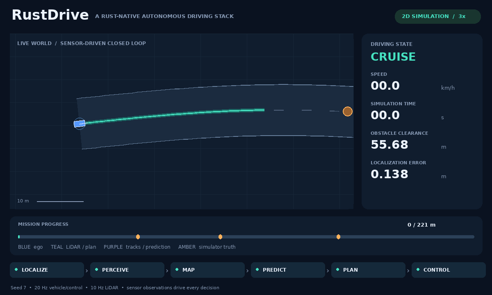

# RustDrive

**A Rust-native autonomous driving stack.**



An original, modular driving stack with a working, deterministic closed-loop simulation. The vehicle processes synthetic LiDAR, fuses noisy GNSS and odometry, tracks and predicts obstacles, plans an avoidance trajectory, and steers and brakes to its destination. The GIF is rendered from the actual Rust run, at 3× playback speed; it is not a scripted vehicle animation.

**Status: simulation research prototype, v0.1.** The verified operating domain is a supplied, wide, two-dimensional road with circular obstacles and idealized vehicle dynamics. This is the starting point for an independent stack, not a replacement for mature driving systems or a system for use on public roads. CARLA, ROS 2, camera AI, 3D SLAM, traffic-rule reasoning, and real vehicle interfaces are not implemented. See the [capability matrix](docs/capabilities.md).

## Build and run

Rust 1.90.0 is pinned in `rust-toolchain.toml`. No ROS, GPU, Docker, models, simulator download, Python, or credentials are required for the Rust demo.

```sh
git clone https://github.com/rsasaki0109/rust_drive.git
cd rust_drive
cargo test --workspace --locked
cargo run --release --locked --bin rustdrive -- run \
  --scenario scenarios/mission.json --seed 7 --output artifacts/demo
```

First-time users without Rust can run `bash scripts/setup.sh` (requires Bash, curl, Internet access, and a supported host). Then `source scripts/env.sh` exposes the locally installed tools. On Windows, install [rustup](https://rustup.rs/) and use the Cargo commands above; helper shell scripts require Bash.

The command prints acceptance results and writes `run.json` and `summary.json`. Exit status is **0** for passed scenario criteria, **1** for failed criteria, and **2** for invalid inputs or I/O errors. Time is simulated; the executable does not sleep or actuate hardware.

## What actually runs

| Component | Implementation |
|---|---|
| Perception | Unlabeled first-return planar LiDAR, range-adaptive clustering, bounded circle fitting, alpha-beta tracking |
| Localization | Three-state extended Kalman filter with wheel-speed / gyro prediction and gated GNSS correction |
| Mapping | Supplied arc-length route plus ray-updated log-odds occupancy grid |
| Prediction | Constant-velocity trajectories with a low-speed deadband; planning adds a time-dependent margin |
| Planning | Three lateral candidates, persistent quintic maneuvers, time-indexed clearance checks, braking and goal behavior |
| Control | Pure pursuit, bounded PI speed control, steering-rate limit, independent freshness / numeric guard |
| Simulation | Bicycle dynamics, noisy ray-cast sensors, moving and crossing obstacles, swept collision evaluation |

The occupancy grid is built and exported for inspection; the current planner uses the supplied route and tracked obstacles, not the occupancy grid. Initial heading and route are supplied calibration / navigation inputs. Runtime simulator obstacle labels and ground-truth poses are used by sensing, rendering, and evaluation, never by planning.

## Reproduce the GIF

Python is optional and used only for visualization. Install Pillow in a virtual environment:

```sh
python3 -m venv .venv
. .venv/bin/activate
python -m pip install -r scripts/requirements-demo.txt
bash scripts/demo.sh
```

Open `artifacts/demo/demo.gif`. To intentionally refresh the README asset:

```sh
bash scripts/demo.sh assets/demo.gif
```

The renderer also emits a PNG and provenance JSON. The committed [demo metadata](assets/demo.json) records the seed, simulation metrics, and regeneration command. Fonts use DejaVu when available, with a portable fallback. GIF bytes may differ between Pillow/font versions; simulation replay is deterministic on the same binary/platform.

## Validation

```sh
bash scripts/check.sh
cargo run --release --locked --bin rustdrive -- run \
  --scenario scenarios/blocked.json --seed 7 --output artifacts/blocked
cargo run --release --locked --bin rustdrive -- run \
  --scenario scenarios/lidar-fault.json --seed 7 --output artifacts/lidar-fault
```

CI checks formatting, Clippy, the workspace test suite, release builds, and the closed-loop demo on Linux, macOS, and Windows, plus GIF generation on Linux. The workflow is defined; remote GitHub Actions runs have not yet been observed. See [validation and limitations](docs/validation.md) for the checks actually executed in this development environment.

## Architecture and contributing

Eight small Cargo crates share transport-independent, serializable contracts. Algorithm implementations are ordinary synchronous Rust libraries. No custom executor or networking middleware is required. Optional future ROS 2 and simulator bridges should translate at the boundaries rather than become dependencies of the algorithms.

- [Architecture and design decisions](docs/architecture.md)
- [Reference OSS research and license analysis](docs/research.md)
- [Implemented and planned capabilities](docs/capabilities.md)
- [Development and scenario authoring](docs/development.md)
- [Roadmap with acceptance gates](docs/roadmap.md)
- [Contributing](CONTRIBUTING.md)

Licensed under [Apache-2.0](LICENSE). Reference projects are studied, not vendored or ported. Dependency licensing is documented in [THIRD_PARTY.md](THIRD_PARTY.md).
