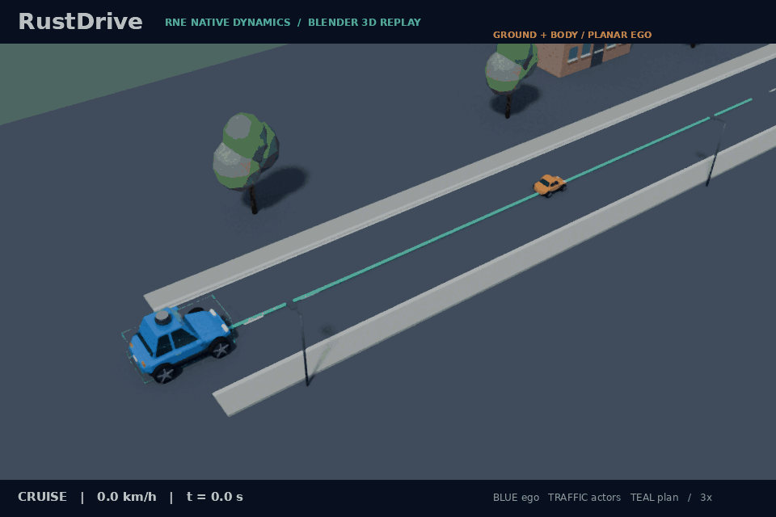
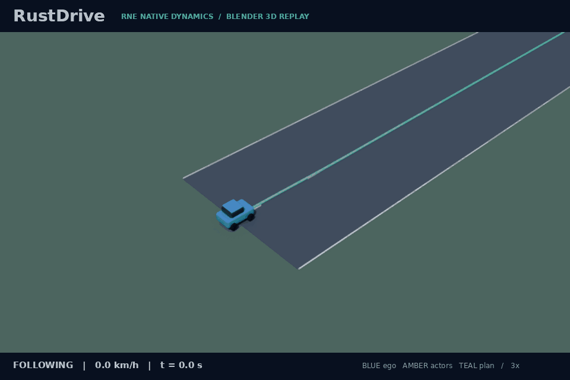
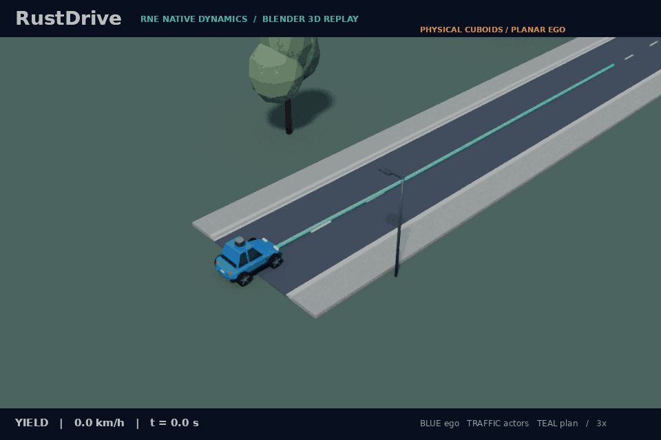
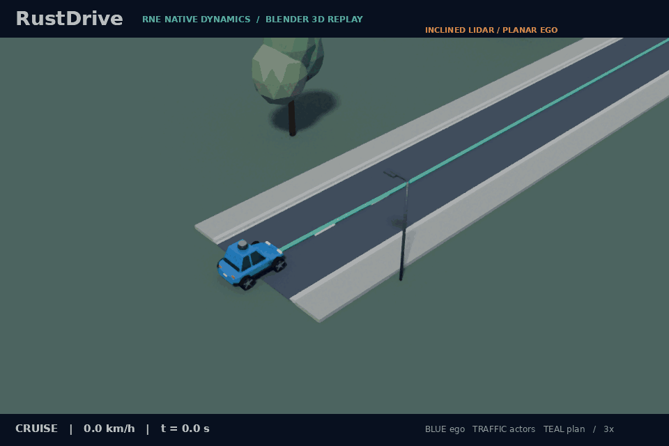
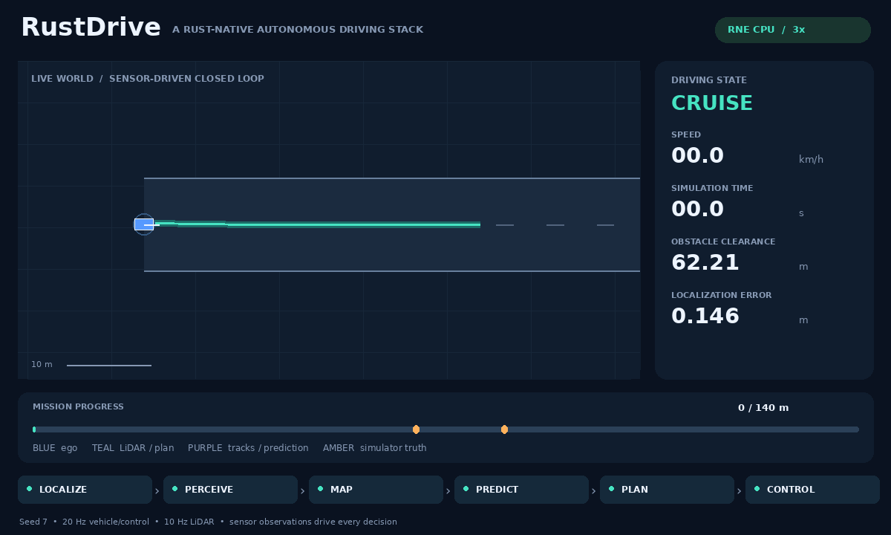
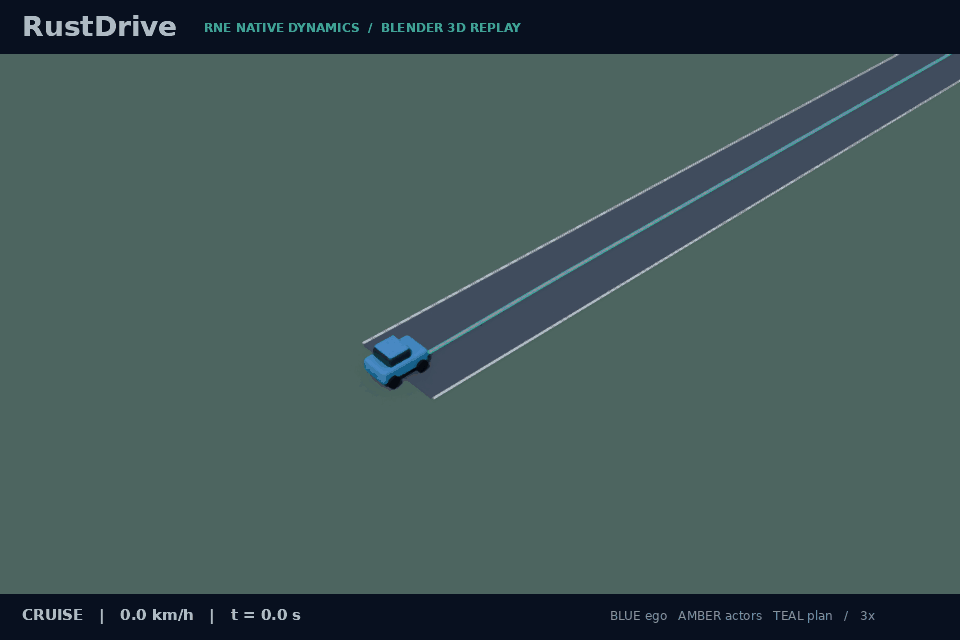
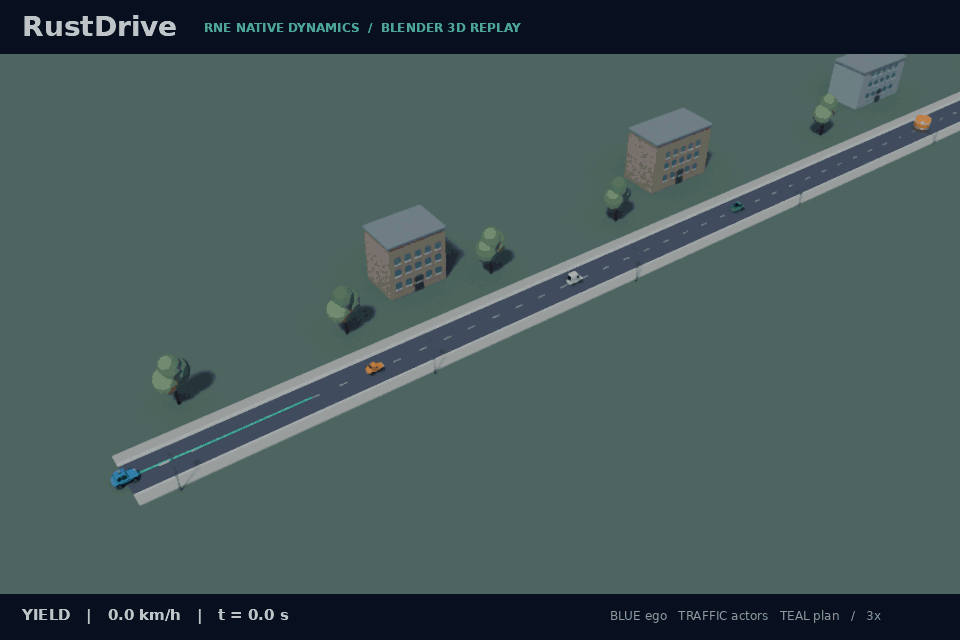
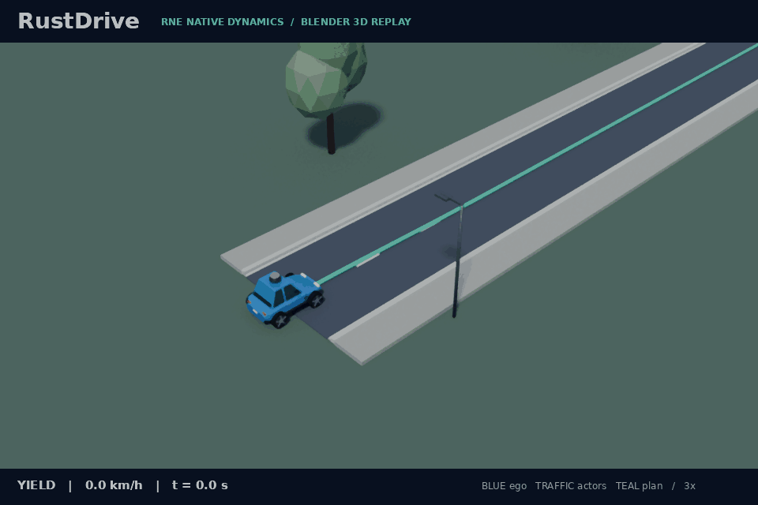
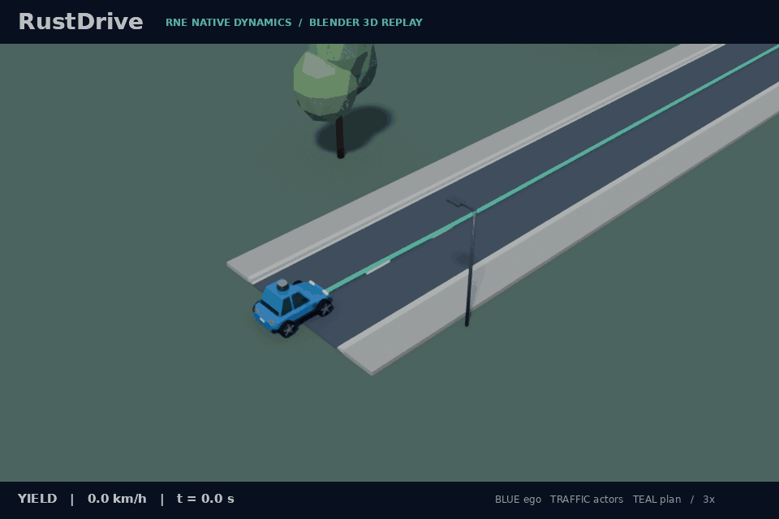

# RustDrive

**A Rust-native autonomous driving stack.**



An original, modular driving stack with a working, deterministic closed-loop simulation. The vehicle processes synthetic LiDAR, fuses noisy GNSS and odometry, tracks and predicts obstacles, and plans steering and braking. The opening GIF shows an actual CPU-only Robot Native Engine (RNE) run: native inclined XYZ LiDAR measures the physical road and a moving lead vehicle, measured ground removal preserves obstacle observations, and ego stops behind the lead. The teal wireframe shows a separate 4.2 × 1.8 × 1.5 m research body. Blender Cycles renders the recorded 22-second episode at 3× playback; motion and downstream object processing remain planar. Moving-traffic acceptance uses conservative circular sweeps; the static-box body guard is exercised by separate fixtures. [Measurements and limitations](docs/ground-lidar.md); [reproduce the GIF](#reproduce-the-gif).

**Status: simulation research prototype, v0.1.** The verified operating domain is known planar road corridors with circular obstacles, including a directed road-network fork, merge and stopped handover after a live closure notification. Bounded OSM import supplies external road geometry; optional native cuboid scenes add actual XYZ sensing, measured local ground removal and research-body clearance. A CPU-only Robot Native Engine (RNE) adapter runs the same pipeline with native Ackermann dynamics and Rapier queries. This is the starting point for an independent stack, not a replacement for mature driving systems or a system for use on public roads. CARLA, ROS 2, camera AI, 3D SLAM, general intersection/priority reasoning, and real vehicle interfaces are not implemented. Mapped signal stops use timestamped infrastructure observations; camera signal recognition is not implemented. See the [capability matrix](docs/capabilities.md).

## Build and run

The pipeline/replay/RNE additions are currently published on `feat/shared-pipeline-rne`; the commands below select that development branch.

Rust 1.90.0 is pinned in `rust-toolchain.toml`. No ROS, GPU, Docker, models, simulator download, Python, or credentials are required for the Rust demo.

```sh
git clone --branch feat/shared-pipeline-rne https://github.com/rsasaki0109/rust_drive.git
cd rust_drive
cargo test --workspace --locked
cargo run --release --locked --bin rustdrive -- run \
  --scenario scenarios/mission.json --seed 7 --output artifacts/demo
```

First-time users without Rust can run `bash scripts/setup.sh` (requires Bash, curl, Internet access, and a supported host). Then `source scripts/env.sh` exposes the locally installed tools. On Windows, install [rustup](https://rustup.rs/) and use the Cargo commands above; helper shell scripts require Bash.

The command prints acceptance results and writes `run.json`, `summary.json` and `sensors.jsonl`. Exit status is **0** for passed scenario criteria, **1** for failed criteria, and **2** for invalid inputs or I/O errors. Time is simulated; the executable does not sleep or actuate hardware.

## Replay recorded sensors

```sh
cargo run --release --locked --bin rustdrive -- replay \
  --log artifacts/demo/sensors.jsonl --output artifacts/replay
```

Replay creates a fresh pipeline and recomputes localization, tracks, predictions, trajectories and commands from observations. It compares every output with the recording, rejects corruption/truncation, and writes `replay.json` only after successful verification. `verified=true` establishes repeatable computation; physical goal/collision acceptance remains in `summary.json`. See the [log contract](docs/sensor-replay.md).

## CPU-only Robot Native Engine demo

The opening 3D GIF replays actual native vehicle dynamics, steering lag and inclined Rapier LiDAR queries against physical road support and a lead capsule. A separate closure-detour recording below uses the default planar sweep. Blender Cycles renders the road, vehicle proxies and recorded planned trajectories on CPU. The shared RustDrive pipeline drives it. No GPU, graphics context, ROS, Docker, CARLA server or pretrained model is required.



Original hatchback, sedan, van and pickup display models include glazing, mirrors, lights, grilles and alloy wheels, with suburban pavements, trees, streetlights and campus buildings. [Model generation and editable Blender scenes](docs/3d-demo.md#models-and-suburban-scenery). These cosmetic models remain display-only; separately authored physical ground/obstacle cuboids enter the optional native scene's sensing and evaluation.

An opt-in native scene now adds actual upright 3D cuboids to Rapier sensing. A ground barrier causes a LiDAR-driven stop; raising the same barrier allows passage underneath. Separate diagnostic scans at three heights and a conservative capsule guard distinguish these cases. The vehicle still moves on a plane, and the extra diagnostic scans do not enter planning. A low slab missed by the operational scan is explicitly rejected after the run. [Scene format, reproduction and limitations](docs/native-scenes.md).



```sh
bash scripts/setup-rne.sh
source scripts/env.sh
cargo +1.95.0 run --release --locked --manifest-path integrations/rne/Cargo.toml -- \
  --scenario scenarios/native-scene-ground-stop.json --scene scenes/ground-barrier.json \
  --plant dynamic --seed 7 --output artifacts/native-scene
bash scripts/check-native-scenes.sh
```

The optional `--multi-height` mode feeds synchronized measured planes into the shared pipeline. Calibrated height selection and XY projection detect the low slab missed by the default scan, while excluding overhead returns. An incomplete or invalid bundle holds braking until a new complete post-fault acquisition arrives. Sparse horizontal planes still leave gaps in height coverage. [Sensor contract, reproduction and remaining blind zones](docs/multi-height-lidar.md).


```sh
cargo +1.95.0 run --release --locked --manifest-path integrations/rne/Cargo.toml -- \
  --scenario scenarios/native-scene-low-stop.json --scene scenes/blind-low-slab.json \
  --multi-height --plant dynamic --seed 7 --output artifacts/multi-height
```

The opt-in `--lidar-3d` mode acquires actual native XYZ returns from 720 azimuth columns and 16 inclined elevation rings. Validated beam ordinals, ranges and directions precede height selection and projection into the existing planar pipeline. This observes a beam between the earlier horizontal scan heights; finite elevation coverage still leaves blind zones. [Contract, independent checks and limitations](docs/lidar-3d.md).



```sh
cargo +1.95.0 run --release --locked --manifest-path integrations/rne/Cargo.toml -- \
  --scenario scenarios/native-scene-mid-stop.json --scene scenes/midbeam-barrier.json \
  --lidar-3d --plant dynamic --seed 7 --output artifacts/lidar-3d-mid
bash scripts/check-lidar-3d.sh --output artifacts/lidar-3d --compact
```

```sh
bash scripts/setup-rne.sh        # Fetch pinned RNE beside this checkout; Rust 1.95.0
# Activate the Pillow venv below; install Blender for 3D rendering.
bash scripts/rne-3d-demo.sh      # Historical closure-detour GIF
# The diagnostic top-down renderer remains available:
bash scripts/rne-demo.sh dynamic
# Or: bash scripts/rne-demo.sh kinematic
```

The integration has its own lockfile and does not enlarge the default workspace dependencies. It uses RNE's native vehicle integrator and Rapier as a ray-query scene; independent circular/swept evaluation scores collisions, with a separate height-aware capsule guard for opt-in cuboids. It does not use Rapier contact response or establish full 3D driving support. Setup preserves existing checkouts and stops if their revision differs. Detailed commands, coordinate conversion and engine fixes: [RNE integration](integrations/rne/README.md).

### Measured ground and a rectangular research body

The additional ground mode installs actual road surfaces in native LiDAR queries. A bounded plane fit uses measured XYZ points and local support to remove ground; insufficient support holds braking. The optional body mode adds an authored 4.2 × 1.8 × 1.5 m cuboid, conservative swept-box clearance and actual force-free Rapier overlap witnesses. The planner retains a conservative circular envelope and planar motion. These are research dimensions and broad near-flat support fixtures, without suspension, contact response or general terrain classification. [Contracts, independent checks and remaining failures](docs/ground-lidar.md).

```sh
bash scripts/check-ground-scenes.sh --compact --output artifacts/ground-scenes
```

### Roads from OpenStreetMap

The Rust importer converts bounded local Overpass JSON into the ordinary directed ENU road graph. A pinned genuine OSM extract includes attribution, ODbL terms and reproducible source conversion. Imported coordinates supply the map; noisy GNSS and odometry still supply localization. Missing width tags use explicit simulation calibration. Lane topology, legal turn restrictions and HD-map accuracy remain outside this importer. [Build, import and drive the external-data route](docs/osm-import.md).

```sh
cargo run --release --locked --bin rustdrive -- import-osm \
  --input maps/osm/german-road-extract.json --output artifacts/osm/map.json \
  --origin-lat 48.136 --origin-lon 10.0695 --default-half-width 3 \
  --scenario-output artifacts/osm/scenario.json \
  --start osm-node-7119017425 --goal osm-node-274969423
cargo run --release --locked --bin rustdrive -- run \
  --scenario artifacts/osm/scenario.json --seed 7 --output artifacts/osm/run
cargo run --release --locked --bin rustdrive -- replay \
  --log artifacts/osm/run/sensors.jsonl --output artifacts/osm/replay
```

The opt-in local-route mode now completes the tested imported sharp branch and authored detour in both reference and native dynamic plants across three seeds. Explicit chassis-reference prediction and course-based steering repair the native turning mismatch; roads, widths and deadlines retain their original values. Short emergency interruptions and narrow sampled margins remain. [Measurements, calibration and limits](docs/chassis-reference.md).

```sh
python3 scripts/check-local-corners.py --backend all --compact --output artifacts/local-corners
```

## Measured-data baselines and bounded GPS loss

Rust ground extraction and XYZ object components now run on SHA-pinned measured point clouds. Independent evaluation preserves their current failures: held-out ground F1 is **0.2592**, six sites have F1 zero, and the natural apartment scan pair cannot be aligned by the local matcher. Four accurate pose cases use explicitly imposed transforms and warm initialization. [Data, licenses, reproduction and limitations](docs/datasets.md).

The same local matcher also feeds a joint pose EKF correction in an optional driving mode. Fresh accepted scans can bridge at most ten seconds since a genuine GPS fix; stale or rejected matching and sensor loss restore braking. Reference and CPU RNE regressions exercise moving five-second GPS loss, recovery and failure controls, with full sensor-only replay. Their fixed map is an authored simulation prior. [Contract and measurements](docs/map-localization.md).

An experimental `--lidar-3d --terrain-objects` mode clusters actual native XYZ surfaces into measured AABBs before supplying planar obstacle envelopes. One independently checked moving-lead stop passes with dense acquisition and a declared research height interval. The initial sparse acquisition failure is preserved as a replayable sensor recording. [Reproduction, calibration and blind zones](docs/terrain-objects.md).

```sh
python scripts/fetch-datasets.py
cargo run --release --locked --bin rustdrive-dataset-eval -- \
  --python python --output artifacts/datasets/report.json
python scripts/check-datasets.py --report artifacts/datasets/report.json
python scripts/check-map-localization.py --backend reference --output artifacts/map-localization
```

## Hazard scenario regression suite

```sh
bash scripts/check-hazards.sh
```

After RNE setup, this CPU-only command runs occlusion, lateral crossings, multiple blocked alternatives, low-friction avoidance and low-friction stopping across seeds 1, 7 and 42. It checks physical outcomes and recomputes every sensor log. All **276 positive local runs** pass (135 reference / 141 native RNE), retaining the preceding 264 and adding twelve original and delayed late-crossing episodes. The full sweep independently checks current-time forecasts and GNSS innovation holds, alongside varied crossing geometry/speed, 5 Hz observations, 50/100 ms LiDAR delivery and temporary acquisition failure. These include live navigation, GNSS faults, reactive traffic, infrastructure signals, stop-sign holds and basic fixed-route yielding. Fixed minimum-clearance floors also guard the fixtures. The planner computes bounded acceleration profiles, uses their arrival times for circular sweeps, and rechecks retimed stops and stationary holds. The suite also checks profile kinematics independently. [Current intersection evidence](docs/intersections.md); [observed-braking results](docs/observed-braking.md); [reactive-traffic baseline](docs/reactive-traffic.md); [terminal-stop baseline](docs/terminal-stopping.md); [GNSS gating baseline](docs/gnss-robustness.md); [tracking improvements](docs/tracking.md); [earlier swept-check regressions](docs/swept-planning.md).

The original short follower fixture now completes its eight-second goal residence within 65 s in both plants across all three seeds. Two additional RNE cases with a five-meter follower sensing range fail the unchanged 1 m clearance floor and remain excluded from the positive count. [Measured changes and limitations](docs/observed-braking.md).

The original late second-crossing fixture now passes the unchanged **1 m** waiting-margin gate: current-time forecasts and a slower clear approach repair its previous **0.267 m** failure. The fixture itself is unchanged; an additional 100 ms delivery case exercises the same actors and crossing geometry. The two short-range follower rejections remain required outside the positive count. [Repair and timing boundaries](docs/intersections.md#repaired-late-conflict).

The previously failing GNSS burst with scheduled traffic now reaches the goal without collisions. An additional fixture keeps evaluation running for 16 seconds after arrival, while the lead actor catches up to the endpoint. [Actual RNE recording, measurements and limits](docs/terminal-stopping.md).



The tracking baseline produced 9/8/7 emergency ticks across the three seeds, compared with 73/83/80 in the preceding implementation. Both the scenario and physical acceptance criteria are unchanged. See the [measured comparison and RNE demo](docs/tracking.md).

## Reactive traffic and observed braking



This actual CPU-only RNE run finishes the original follower fixture at 64.25 s, including eight seconds stopped at the goal, within its unchanged 65 s deadline. The GIF is a Blender 3D replay of recorded telemetry at 3× playback speed. Driving physics remain planar. [Reproduce this 3D run and GIF](docs/3d-demo.md#reproduce-the-follower-gif).

Optional simulator actors now follow their route with bounded acceleration, braking and finite-range proximity observations. Both plants exercise waiting for a stopped lead, resuming, braking behind ego during a GNSS outage and forming a stopped queue. The ego stack uses sustained observed braking for at most one second, then coasts; conservative repeated stops near a narrow-road goal remain visible. [Measured prediction improvement](docs/observed-braking.md). [Actual RNE GIF, actor sensing boundary, measurements and failures](docs/reactive-traffic.md).

```sh
cargo run --release --locked --bin rustdrive -- run \
  --scenario scenarios/traffic-lead-stop.json --seed 7 --output artifacts/traffic
```

## Multiple traffic vehicles



An amber sedan, ivory van and green pickup drive ahead of blue ego, brake behind a static obstacle and form a stopped queue. This is a 3× Blender CPU replay of the complete 65-second native RNE episode, with all 1301 sensor ticks verified. The traffic camera keeps ego and the three active vehicles in view. The three traffic participants use finite-range observations and bounded acceleration in the shared route-following simulator; vehicle types select display meshes, with shared circular footprints rather than separate van/truck dynamics. [Measurements, editable scene and reproduction](docs/vehicle-fleet.md).

```sh
# Activate the Pillow environment and install Blender first.
bash scripts/rne-3d-demo.sh artifacts/fleet/demo.gif \
  scenarios/traffic-fleet-queue.json artifacts/fleet \
  --traffic-models sedan van pickup --camera traffic \
  --scene-output artifacts/fleet/scene.blend
```

## Traffic signals and stopping rules

Mapped signals now stop ego before red, yellow or unknown lines and release it on fresh green. Expired green observations cannot authorize crossing; a restored feed can resume driving. Six fixtures pass in reference and native RNE plants across three seeds, with independently checked physical crossings, continuous standstill and full sensor replay. The feed is synthetic infrastructure state, not camera recognition. [Commands, native 3D preview, measurements and limits](docs/traffic-signals.md).

```sh
cargo run --release --locked --bin rustdrive -- run \
  --scenario scenarios/signal-red-green.json --seed 7 --output artifacts/signals
```

## Stop signs and healthy standstill



Ego now holds near a mapped stop line for two continuous healthy seconds before restarting. Distant/rolling stops and sensor-fault time cannot satisfy the measured stop timer. Five fixtures cover one/two stops, a red signal, a sensed blockage and GNSS recovery in both plants across three seeds. Independent actual-front/actual-speed checks reject crossings without a complete physical stop. Map signs are known configuration; camera sign detection and general right-of-way reasoning remain future work. [Commands, GIF provenance, measured results and limits](docs/stop-signs.md).

```sh
cargo run --release --locked --bin rustdrive -- run \
  --scenario scenarios/stop-sign-single.json --seed 7 --output artifacts/stop-signs
```

## Yielding to priority cross traffic



Known map conflict rectangles now constrain ego's fixed route when LiDAR-derived predictions enter the priority crossing. Fresh healthy sensing and a continuous clear interval release the constraint; predicted traffic may block entry even before it physically reaches the junction. The existing collision planner remains active after release. This is basic mapped yielding, with no arrival-order negotiation, traffic-light recognition or priority decisions by other actors. [Run, physical acceptance, GIF provenance and limitations](docs/intersections.md).

Delayed body-frame LiDAR now uses its acquisition-time EKF pose for detections and occupancy rays. Bounded history accepts covered scans up to 0.35 s old; the yield permission age remains 0.15 s. Motion forecasts now separately propagate acquired tracks to the current control time; the one-second observed-braking interval remains anchored at acquisition. Full delayed-sensor fusion and uncertainty propagation remain unimplemented. [Timing configuration and replay](docs/sensor-replay.md#bounded-acquisition-time-lidar-reprojection).

```sh
cargo run --release --locked --bin rustdrive -- run \
  --scenario scenarios/intersection-crossing.json --seed 7 --output artifacts/intersection
```

## Late cross traffic and current-time forecasts


Before committing to a clear crossing, ego limits its planned approach speed using a response and braking distance budget. A newly observed actor can then restore the existing stop-line constraint. This CPU replay shows the complete native seed-7 episode with two priority crossings. The low-speed creep floor permits clear entry, so the approach policy does not guarantee a reserve against arbitrary late or hidden traffic. [Measured results and reproduction](docs/intersections.md#repaired-late-conflict).

Repeated GNSS innovation rejection now causes a brake hold until a new fix is accepted. A single outlier does not enter that hold; rejected and duplicate fixes cannot authorize recovery. The existing accepted-fix freshness and localization-error gates remain in force. [Validation](docs/validation.md#current-time-forecasts-and-repaired-late-crossings-2026-10-09-jst).

## Mapped destinations and closure detours

The same five-node map supports an eastern destination, a southern branch and a known-closure detour. Route search supplies a centerline to local planning. Live closure snapshots can trigger a stop before the fork and a detour handover; a reopened detour can resume a no-route hold. Mapped signals, stop signs and basic priority yielding operate on fixed routes; general priority negotiation and control remapping during live handover remain future work.

```sh
cargo run --release --locked --bin rustdrive -- run \
  --scenario scenarios/route-handover-fast.json --seed 7 --output artifacts/route-handover
# Also try scenarios/route-no-path.json and scenarios/route-reopen.json.
```

[Live handover, measured results and retained failures](docs/handover.md); [map format](docs/routing.md).

## What actually runs

| Component | Implementation |
|---|---|
| Perception | Unlabeled first-return planar LiDAR, range-adaptive clustering, bounded circle fitting, alpha-beta tracking |
| Localization | Three-state extended Kalman filter with wheel-speed / gyro prediction, joint GNSS innovation gate, Joseph covariance correction and acceptance diagnostics |
| Mapping / navigation | Validated directed road graph, deterministic Dijkstra, live closure snapshots, stopped detour handover and destination selection; ray-updated log-odds occupancy grid |
| Prediction | Constant-velocity baseline with a low-speed deadband; sustained observed braking for at most one second, then coasting; planning adds a time-dependent margin |
| Planning | Three lateral candidates, smooth route geometry and quintic maneuvers joined from the estimated position / heading, synchronized circular sweeps, reachable acceleration / local curvature speed profiles, retimed stop/wait/resume and goal behavior |
| Control | Interpolated pure pursuit, acceleration feedforward with bounded PI speed feedback, steering-rate limit, independent freshness / numeric guard |
| Pipeline / replay | Transport-independent timestamped observations, health checks, full-output JSONL verification |
| Simulation | Reference bicycle or optional RNE native Ackermann ego plants; noisy sensing, optional reactive route-following traffic, swept ego/traffic acceptance |

The occupancy grid is built and exported for inspection; the current planner uses the supplied route and tracked obstacles, not the occupancy grid. Initial heading and route are supplied calibration / navigation inputs. Runtime simulator obstacle labels and ground-truth poses are used by sensing, rendering, and evaluation, never by planning.

## Reproduce the GIF

Python and Blender are optional visualization tools. Install Blender (4.3.2 verified locally; Cycles CPU requires no GPU), then:

```sh
python3 -m venv .venv
. .venv/bin/activate
python -m pip install -r scripts/requirements-demo.txt
bash scripts/setup-rne.sh
source scripts/env.sh
cargo +1.95.0 run --release --locked --manifest-path integrations/rne/Cargo.toml -- \
  --scenario scenarios/native-body-traffic-stop.json --scene scenes/ground-moving-traffic.json \
  --lidar-3d --ground-segmentation --vehicle-body --plant dynamic --seed 7 \
  --output artifacts/ground-moving
cargo run --release --locked --bin rustdrive -- replay \
  --log artifacts/ground-moving/sensors.jsonl --output artifacts/ground-moving/replay
python3 scripts/render_demo_3d.py artifacts/ground-moving/run.json \
  --native-scene artifacts/ground-moving/scene.json \
  --output artifacts/ground-moving/demo.gif --samples 8 --threads 3 \
  --camera traffic --traffic-models sedan
```

Open `artifacts/ground-moving/demo.gif`. The renderer emits a PNG and [provenance JSON](assets/ground-demo.json), auditing recorded body poses, road/obstacle meshes and measured sensor consistency. The published GIF has 75 frames at 960 × 640 pixels. To refresh the README asset intentionally, use `--output assets/ground-demo.gif` in the render command. [Independent physical checks and ground-classification limits](docs/ground-lidar.md); [editable models and older closure-detour reproduction](docs/3d-demo.md).

GIF bytes may differ between Blender/Pillow/font versions; sensor replay is deterministic on the same binary/platform. The reference GIF remains reproducible with `bash scripts/demo.sh`.

## Validation

```sh
bash scripts/check.sh
cargo run --release --locked --bin rustdrive -- run \
  --scenario scenarios/blocked.json --seed 7 --output artifacts/blocked
cargo run --release --locked --bin rustdrive -- run \
  --scenario scenarios/lidar-fault.json --seed 7 --output artifacts/lidar-fault
```

CI checks formatting, Clippy, the workspace test suite, release builds, and the closed-loop demo on Linux, macOS, and Windows, plus GIF generation and the pinned CPU-only RNE integration on Linux. All five jobs passed for the preceding acquisition-time LiDAR revision `0928be3` in [run 37926106405](https://github.com/rsasaki0109/rust_drive/actions/runs/37926106405). The RNE job also renders real mission, three-vehicle fleet, signal-stop, stop-sign, priority-crossing, delayed-recovery and repaired late-crossing frames in 3D on CPU and exports editable scenes. See [validation and limitations](docs/validation.md) for the checks actually executed and the initial infrastructure/toolchain failures.

## Architecture and contributing

Ten small Cargo crates share transport-independent, serializable contracts. Algorithm implementations are ordinary synchronous Rust libraries. No custom executor or networking middleware is required. The optional RNE adapter and future ROS 2/CARLA bridges translate at the boundaries rather than become dependencies of the algorithms.

- [50% maturity goal, capability waypoints and evidence requirements](docs/maturity.md)
- [Mapped signal stops, stale-feed recovery and measured rule acceptance](docs/traffic-signals.md)
- [Stop signs and measured healthy standstill](docs/stop-signs.md)
- [Mapped priority crossings and independent temporal separation](docs/intersections.md)
- [3D RNE GIFs, CPU rendering and reproduction](docs/3d-demo.md)
- [Observed braking, repaired deadline and current regression results](docs/observed-braking.md)
- [Reactive traffic, stop/resume and historical deadline failures](docs/reactive-traffic.md)
- [Terminal stopping, post-arrival evaluation and repaired traffic regression](docs/terminal-stopping.md)
- [GNSS rejection, stopping/recovery and historical traffic failure](docs/gnss-robustness.md)
- [Avoidance continuity and the repaired 6 m/s regression](docs/avoidance-continuity.md)
- [Live closure handover, baseline results and retained failures](docs/handover.md)
- [Road networks, closure detours and regression results](docs/routing.md)
- [Architecture and design decisions](docs/architecture.md)
- [Reference OSS research and license analysis](docs/research.md)
- [Implemented and planned capabilities](docs/capabilities.md)
- [Development and scenario authoring](docs/development.md)
- [Roadmap with acceptance gates](docs/roadmap.md)
- [Contributing](CONTRIBUTING.md)

RustDrive code is licensed under [Apache-2.0](LICENSE). The included OpenStreetMap data and derived road database retain [ODbL 1.0 attribution and provenance](maps/osm/SOURCE.md). Reference projects are studied, not vendored or ported. Dependency licensing is documented in [THIRD_PARTY.md](THIRD_PARTY.md).
