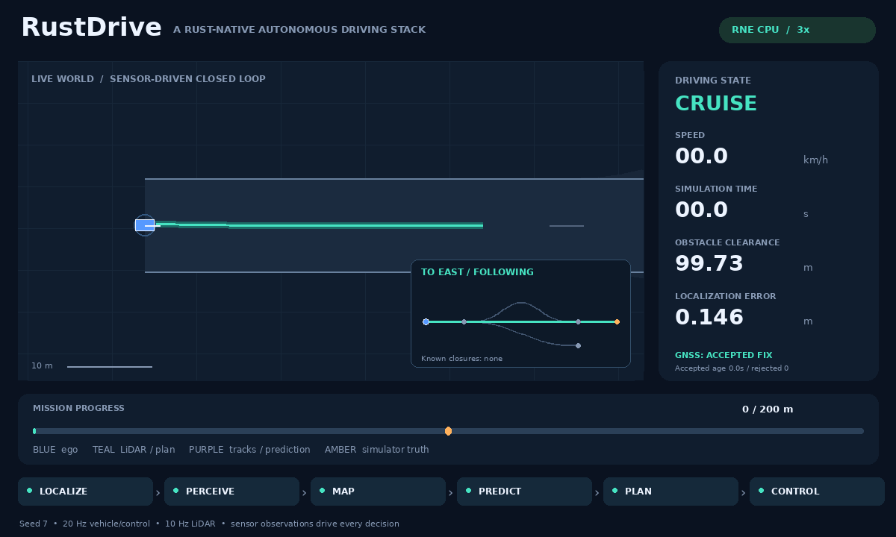

# RustDrive

**A Rust-native autonomous driving stack.**



An original, modular driving stack with a working, deterministic closed-loop simulation. The vehicle processes synthetic LiDAR, fuses noisy GNSS and odometry, tracks and predicts obstacles, plans an avoidance trajectory, and steers and brakes to its destination. The opening GIF shows an actual CPU-only Robot Native Engine (RNE) run: a closure notification arrives during driving, the vehicle stops before the fork, switches to a Dijkstra detour, avoids a sensed obstacle and reaches the mapped destination using native vehicle dynamics and Rapier LiDAR queries. It is a top-down rendering of recorded telemetry at 3× playback speed, with a 6 m/s cruise setting and no optional curvature cap. [Reproduce this RNE demo](#reproduce-the-gif).

**Status: simulation research prototype, v0.1.** The verified operating domain is authored planar road corridors with circular obstacles, including a directed road-network fork, merge and stopped handover after a live closure notification. A CPU-only Robot Native Engine (RNE) adapter also runs the same pipeline with native Ackermann dynamics and Rapier LiDAR queries. This is the starting point for an independent stack, not a replacement for mature driving systems or a system for use on public roads. CARLA, ROS 2, camera AI, 3D SLAM, traffic-rule reasoning, and real vehicle interfaces are not implemented. See the [capability matrix](docs/capabilities.md).

## Build and run

The pipeline/replay/RNE additions are currently published on `feat/shared-pipeline-rne`; the commands below select that development branch.

Rust 1.90.0 is pinned in `rust-toolchain.toml`. No ROS, GPU, Docker, models, simulator download, Python, or credentials are required for the Rust demo.

```sh
git clone --branch feat/shared-pipeline-rne https://github.com/rsasaki0109/rust_drive.git
cd rust_drive
cargo test --workspace --locked
cargo run --release --locked --bin rustdrive -- run \
  --scenario scenarios/mission.json --seed 7 --output artifacts/demo
```

First-time users without Rust can run `bash scripts/setup.sh` (requires Bash, curl, Internet access, and a supported host). Then `source scripts/env.sh` exposes the locally installed tools. On Windows, install [rustup](https://rustup.rs/) and use the Cargo commands above; helper shell scripts require Bash.

The command prints acceptance results and writes `run.json`, `summary.json` and `sensors.jsonl`. Exit status is **0** for passed scenario criteria, **1** for failed criteria, and **2** for invalid inputs or I/O errors. Time is simulated; the executable does not sleep or actuate hardware.

## Replay recorded sensors

```sh
cargo run --release --locked --bin rustdrive -- replay \
  --log artifacts/demo/sensors.jsonl --output artifacts/replay
```

Replay creates a fresh pipeline and recomputes localization, tracks, predictions, trajectories and commands from observations. It compares every output with the recording, rejects corruption/truncation, and writes `replay.json` only after successful verification. `verified=true` establishes repeatable computation; physical goal/collision acceptance remains in `summary.json`. See the [log contract](docs/sensor-replay.md).

## CPU-only Robot Native Engine demo

This is a top-down rendering of an actual RNE run, with friction-limited native vehicle dynamics, steering lag, and 3D Rapier ray queries sampled in a planar LiDAR sweep. The shared RustDrive pipeline drives it. No GPU, graphics context, ROS, Docker, CARLA server or pretrained model is required.

```sh
bash scripts/setup-rne.sh        # Fetch pinned RNE beside this checkout; Rust 1.95.0
# Activate the Pillow venv below to generate the GIF.
bash scripts/rne-demo.sh dynamic
# Or: bash scripts/rne-demo.sh kinematic
```

The integration has its own lockfile and does not enlarge the default workspace dependencies. It uses RNE's native vehicle integrator and Rapier as a ray-query scene; independent circular/swept evaluation scores collisions. It does not use Rapier contact response or establish full 3D driving support. Setup preserves existing checkouts and stops if their revision differs. Detailed commands, coordinate conversion and engine fixes: [RNE integration](integrations/rne/README.md).

## Hazard scenario regression suite

```sh
bash scripts/check-hazards.sh
```

After RNE setup, this CPU-only command runs occlusion, lateral crossings, multiple blocked alternatives, low-friction avoidance and low-friction stopping across seeds 1, 7 and 42. It checks physical outcomes and recomputes every sensor log. All 72 local reference/RNE runs pass, including 24 live-navigation runs. Fixed minimum-clearance floors also guard the fixtures. The planner computes bounded acceleration profiles, uses their arrival times for circular sweeps, and rechecks retimed stops and stationary holds. The suite also checks profile kinematics independently. [Current avoidance results and model boundaries](docs/avoidance-continuity.md); [tracking improvements](docs/tracking.md); [earlier swept-check regressions](docs/swept-planning.md).


Low-friction tracking now produces 9/8/7 emergency ticks across the three seeds, compared with 73/83/80 in the preceding implementation. Both the scenario and physical acceptance criteria are unchanged. See the [measured comparison and RNE demo](docs/tracking.md).

## Mapped destinations and closure detours

The same five-node map supports an eastern destination, a southern branch and a known-closure detour. Route search supplies a centerline to local planning. Live closure snapshots can trigger a stop before the fork and a detour handover; a reopened detour can resume a no-route hold. Signals and intersection priority remain future work.

```sh
cargo run --release --locked --bin rustdrive -- run \
  --scenario scenarios/route-handover-fast.json --seed 7 --output artifacts/route-handover
# Also try scenarios/route-no-path.json and scenarios/route-reopen.json.
```

[Live handover, measured results and retained failures](docs/handover.md); [map format](docs/routing.md).

## What actually runs

| Component | Implementation |
|---|---|
| Perception | Unlabeled first-return planar LiDAR, range-adaptive clustering, bounded circle fitting, alpha-beta tracking |
| Localization | Three-state extended Kalman filter with wheel-speed / gyro prediction and gated GNSS correction |
| Mapping / navigation | Validated directed road graph, deterministic Dijkstra, live closure snapshots, stopped detour handover and destination selection; ray-updated log-odds occupancy grid |
| Prediction | Constant-velocity trajectories with a low-speed deadband; planning adds a time-dependent margin |
| Planning | Three lateral candidates, smooth route geometry and quintic maneuvers joined from the estimated position / heading, synchronized circular sweeps, reachable acceleration / local curvature speed profiles, retimed stop/wait/resume and goal behavior |
| Control | Interpolated pure pursuit, acceleration feedforward with bounded PI speed feedback, steering-rate limit, independent freshness / numeric guard |
| Pipeline / replay | Transport-independent timestamped observations, health checks, full-output JSONL verification |
| Simulation | Reference bicycle or optional RNE native Ackermann plants; noisy LiDAR/GNSS/odometry, swept collision evaluation |

The occupancy grid is built and exported for inspection; the current planner uses the supplied route and tracked obstacles, not the occupancy grid. Initial heading and route are supplied calibration / navigation inputs. Runtime simulator obstacle labels and ground-truth poses are used by sensing, rendering, and evaluation, never by planning.

## Reproduce the GIF

Python is optional and used only for visualization. Install Pillow in a virtual environment:

```sh
python3 -m venv .venv
. .venv/bin/activate
python -m pip install -r scripts/requirements-demo.txt
bash scripts/setup-rne.sh
bash scripts/rne-demo.sh dynamic artifacts/rne-dynamic/demo.gif scenarios/route-handover-fast.json
```

Open `artifacts/rne-dynamic/demo.gif`. To intentionally refresh the opening README asset:

```sh
bash scripts/rne-demo.sh dynamic assets/rne-demo.gif scenarios/route-handover-fast.json
```

The renderer also emits a PNG and provenance JSON. The committed [RNE demo metadata](assets/rne-demo.json) records the engine revision, seed, simulation metrics, and regeneration command. Fonts use DejaVu when available, with a portable fallback. GIF bytes may differ between Pillow/font versions; simulation replay is deterministic on the same binary/platform. The standalone reference simulator's GIF can also be regenerated with `bash scripts/demo.sh`; its provenance is in [reference demo metadata](assets/demo.json).

## Validation

```sh
bash scripts/check.sh
cargo run --release --locked --bin rustdrive -- run \
  --scenario scenarios/blocked.json --seed 7 --output artifacts/blocked
cargo run --release --locked --bin rustdrive -- run \
  --scenario scenarios/lidar-fault.json --seed 7 --output artifacts/lidar-fault
```

CI checks formatting, Clippy, the workspace test suite, release builds, and the closed-loop demo on Linux, macOS, and Windows, plus GIF generation and the pinned CPU-only RNE integration on Linux. All five jobs passed for the preceding live-handover revision in [run 37860843074](https://github.com/rsasaki0109/rust_drive/actions/runs/37860843074). See [validation and limitations](docs/validation.md) for the checks actually executed and the initial infrastructure/toolchain failures.

## Architecture and contributing

Ten small Cargo crates share transport-independent, serializable contracts. Algorithm implementations are ordinary synchronous Rust libraries. No custom executor or networking middleware is required. The optional RNE adapter and future ROS 2/CARLA bridges translate at the boundaries rather than become dependencies of the algorithms.

- [Avoidance continuity and the repaired 6 m/s regression](docs/avoidance-continuity.md)
- [Live closure handover, baseline results and retained failures](docs/handover.md)
- [Road networks, closure detours and regression results](docs/routing.md)
- [Architecture and design decisions](docs/architecture.md)
- [Reference OSS research and license analysis](docs/research.md)
- [Implemented and planned capabilities](docs/capabilities.md)
- [Development and scenario authoring](docs/development.md)
- [Roadmap with acceptance gates](docs/roadmap.md)
- [Contributing](CONTRIBUTING.md)

Licensed under [Apache-2.0](LICENSE). Reference projects are studied, not vendored or ported. Dependency licensing is documented in [THIRD_PARTY.md](THIRD_PARTY.md).
