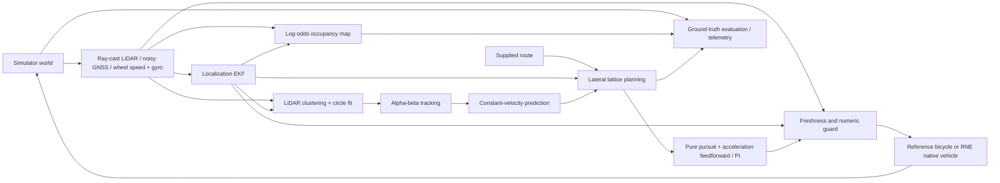

# Architecture

## Goal and first operating domain

RustDrive aims to become an independent Rust autonomous driving stack. Version 0.1 first establishes a small executable baseline: a vehicle follows a known curved route, avoids sensed objects, yields on a blocked narrow road, and brakes when required sensing becomes stale. The reference simulator is intentionally 2D, CPU-only, deterministic, and small enough to exercise in ordinary CI. These properties make a useful algorithm development harness; they do not establish physical or operational validity.

## Current dataflow

Ground truth never flows into obstacle prediction or planning. The simulator initializes heading at a known spawn calibration, exposes the configured route, and synthesizes noisy measurements from the world. Separate evaluation observes truth to detect collisions, road violations, and localization error.

## Crates and ownership

| Crate | Responsibility | Depends on |
|---|---|---|
| `rustdrive-core` | SI contracts, planar transforms, route interpolation and projection, algorithm traits | serde |
| `rustdrive-localization` | State and covariance estimation, innovation gating | core |
| `rustdrive-perception` | Point clustering, circular-object fitting, track identity and velocity | core |
| `rustdrive-mapping` | Bounded occupancy grid and ray updates | core |
| `rustdrive-prediction` | Time-indexed constant-velocity baseline | core |
| `rustdrive-planning` | Candidate selection, maneuver persistence, braking / goal modes | core |
| `rustdrive-control` | Longitudinal and lateral actuation, freshness guard | core |
| `rustdrive-pipeline` | Sensor-only orchestration, freshness/health, versioned recording and replay | core + algorithm crates, serde / serde_json |
| `rustdrive-sim` | Reference sensors/plant, backend interface, independent evaluation and CLI | core + pipeline, serde / serde_json |
| `rustdrive-rne` (optional standalone workspace) | RNE world/vehicle/sensor adapter | core + pipeline + sim, renderer-independent RNE crates |

Unsafe Rust is forbidden at workspace level. There is no global message bus, custom scheduling runtime, ROS dependency, model download, or external service. Algorithm crates can be embedded into another application; the simulator is the current application, not a universal runtime.

## Coordinate and timing contract

- Length in meters, speed in m/s, acceleration in m/s², time in seconds, angles in radians.
- World frame is planar ENU (`x` east, `y` north), right-handed yaw positive counterclockwise.
- LiDAR points are body-frame (`x` forward, `y` left). Detections, tracks, route points, and trajectories are world-frame.
- Timestamps refer to one monotonically advancing simulation clock. Duplicate/out-of-order observations cannot refresh health. Clock regressions fail before mutation; clock gaps over 0.25 s brake. Delayed-sensing motion compensation is absent.
- Vehicle/control and EKF prediction: 20 Hz. LiDAR/perception/tracking/map: 10 Hz. GNSS: 5 Hz. Prediction and planning: 20 Hz.
- Lidar scan timestamps are checked independently of an empty scan: no returns are a valid observation, not a sensor failure.
- `sensors.jsonl` has a separate version-1 sensor-only header/tick/count-footer contract, including calibrated route and expected outputs. Replay feeds observations to a fresh pipeline; expected outputs are comparison evidence only. [Contract and failure behavior](sensor-replay.md).
- `run.json` has `schema_version = 1`, includes traceable inputs, output commands, estimates and evaluation truth, and is intended for developer inspection. It is not yet a stable external transport schema.

## Shared application boundary

`DrivingPipeline::step(&SensorFrame)` owns EKF, perception/tracking, occupancy, predictor, planner and controller state. Input contains only a monotonic clock, optional timestamped odometry/GNSS/body-frame LiDAR, and explicit LiDAR acquisition failure. Output contains estimate, tracks, predictions, trajectory, command and health diagnostics. It has no simulator object/pose inputs. Configuration supplies route, initial pose calibration, vehicle dimensions and optional calibrated forward/braking/lateral acceleration limits; this is a known-route demonstration.

Missing/stale odometry, LiDAR or GNSS, invalid samples, excessive covariance and acquisition failure select finite emergency braking. Healthy empty LiDAR is accepted; a failed acquisition brakes immediately. An invalid clock returns `Err`; callers must stop rather than reuse a command. The reference and RNE backends implement observation/advance boundaries and share the same independent evaluator. Runtime truth stays inside sensor synthesis and evaluation/rendering.

## Algorithms

**Localization.** State `(x, y, yaw)` and a full 3×3 covariance. Wheel speed and gyro propagate pose and the covariance Jacobian; GNSS position provides sequential scalar corrections. Invalid, stale, or greater-than-six-sigma innovations are rejected. This is not a bias-estimating 3D inertial navigation filter. Initial yaw is configured rather than estimated from GNSS at rest.

**Perception.** A 720-ray first-return LiDAR has a 45 m range and ±0.015 m bounded range noise. Connected components use a range-adaptive point distance. Components smaller than three returns are discarded. At least five points allow an algebraic circle fit with residual and radius bounds; other clusters use an inflated surface envelope. Circular objects are the demonstrated shape class; semantic classification is absent. Nearest-neighbor alpha-beta tracking expires observations after 0.6 s, bounds inferred velocity, and operates at 10 Hz. Association is greedy, not globally optimal, and clustering is quadratic in the number of hit points.

**Mapping.** A 0.5 m world-aligned log-odds grid records ray free-space and hit endpoints. It exports occupied cells for debugging. No-return beams are not exported by the sensor and therefore do not clear the entire sensing horizon. Dynamic-object ghost cells and repeated discretized ray cells remain limitations. The grid does not supply the current planner's collision geometry and does not perform SLAM or route discovery.

**Prediction.** Eight seconds of constant-velocity extrapolation at 0.2 s spacing. Velocities below 0.7 m/s are treated as static to suppress tracking jitter. This heuristic can miss slowly moving objects. Planning adds a margin growing up to five seconds; the margin is heuristic, not a calibrated probability or covariance.

**Planning.** The supplied polyline route is parameterized by arc length. Lateral targets are `0`, `+3.5`, and `−3.5` m, filtered by road width and the ego circular footprint. An anchored quintic shift preserves maneuver progress across replans; a fading position/tangent correction joins it from the current estimated position and heading when actual steering lags. The planner penalizes sign changes and avoids jumping to the opposite side once the vehicle is displaced. The planner interpolates supplied route knots with quintic Hermite centerline segments sharing position and first/second derivatives, and applies continuous normal offsets. The supplied polyline corridor remains unchanged; generated samples are checked against it. Each candidate starts with 81 geometric samples over up to 40 m. Circular collision envelopes are swept continuously along their connecting segments against linearly interpolated predictions, splitting at every intervening prediction knot. Prediction endpoints remain occupied after the forecast horizon. Malformed forecasts return an emergency trajectory.

Each geometry receives an arc-length speed profile: local circumcircle curvature caps, backward propagation with 20% nominal braking headroom and unchanged hard braking authority, and forward calibrated-acceleration propagation from the measured speed. Cruise overspeed is recovered with bounded deceleration rather than an instantaneous clamp. Arrival times integrate constant acceleration with `dt = 2 * distance / (v0 + v1)`; there is no 3 m/s timing floor. Goal and obstruction stops end at zero speed and include an eight-second stationary hold. A blocked profile is shortened by the existing 4 m contact-distance buffer, retimed, and swept again. Unsafe retiming or an unreachable hard bound rejects that candidate; no remaining candidate produces an empty emergency trajectory. Once stopped at a blocked destination, the vehicle holds until a candidate clears. The desired goal remains one meter before the endpoint; an estimate that passes it while moving gets a monotonic reachable stop within the remaining corridor, with the endpoint retained as a hard boundary.

For accelerated segments, the circular sweep additionally covers the deviation from the temporal chord with a `|delta_speed| * segment_duration / 8` radius inflation. Calibrated low lateral authority lengthens proposed quintic shifts; the chosen length persists across replans and sampled speed/curvature bounds still decide feasibility. This is a three-offset, sampled-geometry baseline, not joint tire-force optimization or a controller tracking guarantee. [Current tracking methods and evidence](tracking.md); [previous speed planning](speed-planning.md) and [swept-check evidence](swept-planning.md).

**Control.** Pure pursuit uses a shorter speed-dependent preview, an interpolated lookahead-circle intersection, bounded steering and a steering-rate limit. Emergency recovery starts from the emitted zero steering command. Longitudinal control uses the first segment's acceleration as feedforward plus bounded PI feedback on its initial speed; a stationary hold does not command forward acceleration. The pipeline health checks and control guard substitute a −6 m/s² command for non-finite output, missing/stale/invalid sensors, acquisition errors or excessive position variance. A planner emergency also brakes. The simulation adapters enforce actual authority; infeasible states can trigger repeated emergency fallback. This guards a simulation workflow; it is not a certified safety mechanism or redundant vehicle controller.

**Simulation and evaluation.** A kinematic bicycle with bounded speed, acceleration and steering is integrated every 0.05 s. The ego and obstacles have circular collision footprints; relative swept segments test collision between integration endpoints. Current and terminal overlaps are also scored, and newly active actors receive endpoint checks. Each evaluated tick counts at most one collision; exact continuous activation-time checking remains absent. Road containment uses the ego center plus circular radius against route half-width. Tire friction and actuator lag are outside the reference model. The optional RNE dynamic plant adds a friction limit and steering lag; road elevation, suspension, rectangular collision evaluation, weather, camera imagery and traffic laws remain outside the demonstrated operating domain. See the [adapter boundaries](../integrations/rne/README.md). No throughput or real-time guarantee is claimed.

## Extension decisions

1. Preserve algorithm crates and shared coordinate/clock contracts. Put frame conversions and external message schemas into adapter crates.
2. Implement and test a CARLA synchronous bridge before claiming CARLA support: sensor callbacks → timestamped Rust inputs → controls → independent CARLA collision/route criteria.
3. Add ROS 2 integration optionally. A bridge should own ROS dependencies; core algorithms should still run in CI without ROS.
4. Add learned perception/prediction behind existing traits, with explicit model provenance, licensing, preprocessing, warmup, inference failure behavior, and benchmark datasets. Classical baselines remain available.
5. Use established channels or a mature transport only when a concrete process-distribution requirement appears. Avoid building middleware as a prerequisite to driving.
6. Grow typed units, calibration, map/route validation, trace schema migration, deadline monitoring, and sensor health models as external adapters are introduced.
