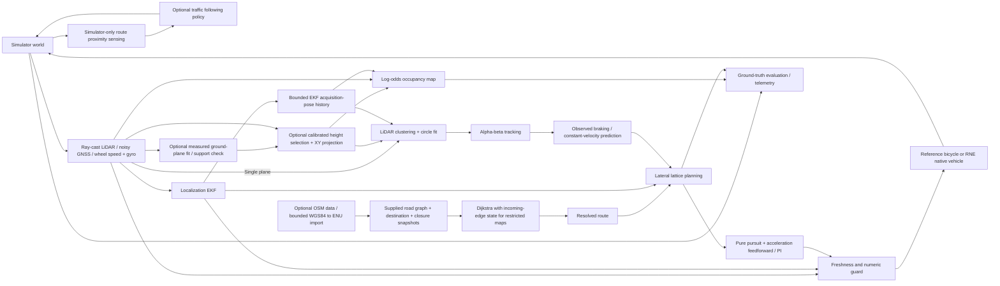

# Architecture

## Goal and first operating domain

RustDriving aims to become an independent Rust autonomous driving stack. Version 0.1 first establishes a small executable baseline: a vehicle follows a known curved route, avoids sensed objects, yields on a blocked narrow road, and brakes when required sensing becomes stale. The reference simulator is intentionally 2D, CPU-only, deterministic, and small enough to exercise in ordinary CI. These properties make a useful algorithm development harness; they do not establish physical or operational validity.

## Current dataflow

Ground truth never flows into obstacle prediction or planning. The simulator initializes heading at a known spawn calibration, exposes the configured route, and synthesizes noisy measurements from the world. Separate evaluation observes truth to detect collisions, road violations, and localization error.

The optional RNE `--scene` input installs upright yaw-rotated cuboids in native Rapier queries. By default, the existing 0.6 m horizontal LiDAR plane remains the sole operational scan. Two additional horizontal planes and 200 Hz native positions are recorded only in `scene.json`, outside the sensor-only replay contract. A post-run conservative vertical-capsule evaluator adds physical scene failures to acceptance; it cannot command the vehicle. An independent Python slab-ray and rectangle-edge oracle checks the evidence. Native ego motion remains planar, without contact forces or suspension. [Scene contract](native-scenes.md).

With the additional explicit `--multi-height` option, all three measured horizontal planes enter `SensorFrame.multi_height_lidar`; the ordinary scan is absent. The sensor-only header supplies bounded plane-height calibration and the vehicle's vertical collision interval. After validating the entire synchronized bundle, the pipeline selects relevant calibrated heights, removes duplicate XY cells and uses its acquisition-time EKF pose for the existing planar perception and mapping. Malformed or failed bundles latch braking until a strictly newer complete acquisition after the fault epoch. Delay, cadence and failure injection transport the entire bundle atomically. Scene labels and geometry remain outside the driver. This is sparse measured-height projection, without volumetric object reconstruction or coverage between planes. [Contract and limits](multi-height-lidar.md).

## Crates and ownership

The additional `--lidar-3d --ground-segmentation` mode installs physical road surfaces in the native query world and fits a bounded local plane from validated measured XYZ returns. Global angular support and local residual-cell support determine removal; insufficient support holds braking. Scene ground labels stay outside operational sensing. The 180 × 16 acquisition grid is specific to this mode; the earlier 720 × 16 mode is unchanged. The accepted fixtures assume broad near-flat support surfaces. [Ground contract and limits](ground-lidar.md).

With `--vehicle-body`, an authored rectangular research body adds actual force-free Rapier overlap witnesses and a separate swept upright-box evaluator. The driver uses its circumscribed planar radius and a calibrated vertical clearance interval. Native Ackermann dynamics remain the sole motion integrator; this does not add tire contact response, suspension or six-degree-of-freedom motion. Recorded road and obstacle geometry remain simulator-only evaluation inputs.

The optional OSM importer resolves bounded WGS84 coordinates to local ENU, retains shared junctions and directed way geometry, and emits the ordinary road graph. Imported road widths are explicit simulation calibration, not measured lane boundaries. Dataset attribution and ODbL terms are separate from the Rust implementation's license. [Import contract and provenance](osm-import.md).

Unconditional `no` and `only` junction rules now constrain directed transitions.
Restricted search retains the incoming edge at each node, so a shorter forbidden
arrival does not hide a longer legal arrival. Closures remain independent;
restricted-map sensor replay reconstructs search from the header. The OSM
importer supports bounded motorcar node-via relations and rejects relevant
unsupported semantics. Navigation and fixed-route mapped stop controls remain
separate configurations. [Turn contract and evidence](turn-restrictions.md).

Optional `local_route_geometry` uses bounded steering-radius corner fillets and a shorter pursuit preview for sparse external roads. Its internal planning arc differs from the original map arc; candidate containment and physical evaluation still use the supplied unchanged corridor. Impossible/overlapping fillets fail validation. Mapped signal, sign and priority-zone coordinates are currently excluded from this mode; their existing route-coordinate behavior remains separate. Optional `rear_axle_offset_m` calibrates low-speed chassis odometry prediction and temporary planning/control course while retaining body yaw for sensors. The native dynamic local mode selects its declared rear-axle distance; default/reference behavior is unchanged. [Reference contract and evidence](chassis-reference.md).

| Crate | Responsibility | Depends on |
|---|---|---|
| `rustdriving-core` | SI contracts, planar transforms, route interpolation and projection, algorithm traits | serde |
| `rustdriving-routing` | Validated directed maps, shortest-distance routing, edge closures and bounded OSM import | core, serde |
| `rustdriving-localization` | State/covariance estimation, innovation gating, bounded local SE(2) fixed-map registration | core |
| `rustdriving-perception` | Point clustering, circular-object fitting, track identity/velocity, bounded XYZ terrain/components | core |
| `rustdriving-mapping` | Bounded occupancy grid and ray updates | core |
| `rustdriving-prediction` | Time-indexed observed braking and constant-velocity baseline | core |
| `rustdriving-planning` | Candidate selection, maneuver persistence, braking / goal modes | core |
| `rustdriving-control` | Longitudinal and lateral actuation, freshness guard | core |
| `rustdriving-pipeline` | Sensor-only orchestration, freshness/health, versioned recording and replay | core + algorithm crates, serde / serde_json |
| `rustdriving-sim` | Reference sensors/plant, backend interface, independent evaluation and CLI | core + pipeline, serde / serde_json |
| `rustdriving-dataset-eval` | Bounded PCD/LZF/VTK readers, measured-cloud evaluation and explicit semi-synthetic pose scoring | core + perception + localization, serde_json; Python SHA verification |
| `rustdriving-rne` (optional standalone workspace) | RNE world/vehicle/sensor adapter | core + pipeline + sim, renderer-independent RNE crates |

Unsafe Rust is forbidden at workspace level. There is no global message bus, custom scheduling runtime, ROS dependency, model download, or external service. Algorithm crates can be embedded into another application; the simulator is the current application, not a universal runtime.

## Coordinate and timing contract

- Length in meters, speed in m/s, acceleration in m/s², time in seconds, angles in radians.
- World frame is planar ENU (`x` east, `y` north), right-handed yaw positive counterclockwise.
- LiDAR points are body-frame (`x` forward, `y` left). Detections, tracks, route points, and trajectories are world-frame.
- Timestamps refer to one monotonically advancing simulation clock. Duplicate/out-of-order observations cannot refresh health. Clock regressions fail before mutation; clock gaps over 0.25 s brake. LiDAR detections and map rays use a bounded acquisition-time pose estimate, described below; general delayed-sensor fusion is absent.
- Vehicle/control and EKF prediction: 20 Hz. Default LiDAR/perception/tracking/map: 10 Hz. GNSS: 5 Hz. Prediction and planning: 20 Hz. Simulator-only timing injection can thin delivered LiDAR observations and delay them without changing their acquisition stamps or body-frame points.
- Lidar scan timestamps are checked independently of an empty scan: no returns are a valid observation, not a sensor failure.
- `sensors.jsonl` has a separate version-1 sensor-only header/tick/count-footer contract, including calibrated route and expected outputs. Replay feeds observations to a fresh pipeline; expected outputs are comparison evidence only. [Contract and failure behavior](sensor-replay.md).
- `run.json` has `schema_version = 1`, includes traceable inputs, output commands, estimates and evaluation truth, and is intended for developer inspection. It is not yet a stable external transport schema.

## Shared application boundary

`DrivingPipeline::step(&SensorFrame)` owns EKF, perception/tracking, occupancy, predictor, planner and controller state. Input contains only a monotonic clock, optional timestamped odometry/GNSS/body-frame LiDAR, and explicit LiDAR acquisition failure. Output contains estimate, tracks, predictions, trajectory, command, health diagnostics and GNSS observed/accepted timestamp, decision, NIS and count diagnostics. It has no simulator object/pose inputs. Configuration supplies route, initial pose calibration, vehicle dimensions and optional calibrated forward/braking/lateral acceleration limits; this is a known-route demonstration.

Missing/stale odometry, LiDAR or GNSS, invalid samples, excessive covariance and acquisition failure select finite emergency braking. Healthy empty LiDAR is accepted; a failed acquisition brakes immediately. An invalid clock returns `Err`; callers must stop rather than reuse a command. The reference and RNE backends implement observation/advance boundaries and share the same independent evaluator. Runtime truth stays inside sensor synthesis and evaluation/rendering.

## Algorithms

Optional fixed-map localization registers synchronous measured body-XY scans to an offline supplied world map, fuses accepted XY/body-yaw poses and preserves genuine GNSS timestamps. Fresh accepted map scans bridge only bounded post-fix outages; stale/rejected scans and the ten-second maximum restore normal braking. [Timing, covariance assumptions and failures](map-localization.md).

Optional XYZ terrain/components keep calibrated raw-beam validation and measured AABBs before planar detection envelopes. Sparse support faults retain braking; local geometric support is not road semantics. A separate measured-data evaluator keeps labels and imposed pose transforms outside algorithm input. Its held-out terrain failure and rejected natural alignment prevent claiming general 3D perception or real-motion localization. [Inputs and scores](datasets.md).

Separate offline research adapters now compute recorded-depth 6DoF pair odometry
and local pose against a fixed first measured cloud, and run Rust CPU ONNX
detection on real urban photographs. Pose labels are parsed only after all
depth fits; image reference labels enter only independent scoring. Neither
adapter feeds the driving EKF, planner or control. Rejected and unscorable
fits remain in their denominators; uncertainty allowances are provisional.
[Recorded-motion contract](recorded-motion.md); [urban-camera diagnostic](road-camera-evaluation.md).

**Localization.** State `(x, y, yaw)` and a full 3×3 covariance. Wheel speed and gyro propagate pose and the covariance Jacobian; GNSS position first passes a joint two-dimensional NIS gate using the full x/y innovation covariance and threshold 36, then receives independent scalar corrections with Joseph covariance updates. Invalid, duplicate/older or excessive innovations are rejected. Received but rejected fixes do not refresh accepted-GNSS health. Two consecutive strictly new fixes rejected by the innovation gate also activate `GnssInnovationHold` and braking, before the existing 0.75 s accepted-fix-age bound when applicable. A single outlier does not activate this additional hold. Only a newly accepted correction resets the private streak; missing, duplicate, old or invalid fixes neither add to it nor clear it. Good fixes can recover after a bounded outage without resetting estimator state. [GNSS baseline](gnss-robustness.md) and [current replay health contract](sensor-replay.md#gnss-acceptance-diagnostics). This conservative sustained-rejection policy is not a bias-estimating 3D inertial navigation filter or a general estimator-validity guarantee. Initial yaw is configured rather than estimated from GNSS at rest.

**Perception.** A 720-ray first-return LiDAR has a 45 m range and ±0.015 m bounded range noise. Connected components use a range-adaptive point distance. Components smaller than three returns are discarded. At least five points allow an algebraic circle fit with residual and radius bounds; other clusters use an inflated surface envelope. Circular objects are the demonstrated shape class; semantic classification is absent. Nearest-neighbor alpha-beta tracking expires observations after 0.6 s, bounds inferred velocity, and updates on accepted scans, normally at 10 Hz. Association is greedy, not globally optimal, and clustering is quadratic in the number of hit points.

**Acquisition-time LiDAR transform.** The pipeline retains at most 64 timestamped EKF poses over a 0.35 s lookup window, keeping one predecessor for interpolation at the age boundary. History begins at the first pipeline step and records the pose after that step's prediction and GNSS correction. Exact acquisition timestamps use the stored pose directly; intermediate timestamps interpolate position and the shortest wrapped yaw arc between estimates no more than 0.25 s apart. The pipeline never extrapolates before history or across an uncovered clock gap. A new scan older than 0.35 s or without a covered pose is invalid and cannot update tracks, map rays or accepted-LiDAR age. Both world-frame detections and occupancy ray origins use this acquisition pose. Acquisition timestamps remain the tracker observation times.

This corrects transforming delayed body-frame returns with the latest ego pose. It does not smooth past poses after later GNSS fixes, fuse delayed odometry/GNSS at their acquisition times, deskew individual rays or propagate pose covariance. Motion prediction separately advances acquired tracks to the current control time without changing their observation stamps. These bounded steps do not establish complete latency compensation or general delayed-scene safety. [Sensor contract and reproduction](sensor-replay.md).

**Mapping.** A 0.5 m world-aligned log-odds grid records ray free-space and hit endpoints. It exports occupied cells for debugging. No-return beams are not exported by the sensor and therefore do not clear the entire sensing horizon. Dynamic-object ghost cells and repeated discretized ray cells remain limitations. The grid does not supply the current planner's collision geometry and does not perform SLAM or route discovery.

**Optional inclined XYZ acquisition.** The native `--lidar-3d` adapter uses RNE's existing 16-ring sensor with 720 azimuth columns and ±15° elevation. Each actual return enters `SensorFrame.lidar3d` as an ordinal and a point in body-forward/body-left/road-datum-up coordinates. Bounded `PipelineConfig.lidar3d` calibration defines the ring geometry, ranges, mount height and collision-height interval. Unique ordinals, finite points, measured range and beam direction are checked before height filtering; deterministic ordinal order keeps one point per 5 cm XY cell. The resulting planar cloud uses the ordinary acquisition-pose lookup, clustering, mapping, tracking and planning path. No cuboid dimensions or simulator truth enter that projection. Atomic delivery and the advanced-scan fault latch require a complete valid acquisition newer than the fault control time before recovery. Ordinary, horizontal multi-height and XYZ inputs are exclusive. The sensor assumes a flat road and yaw-only mount; acquisition is instantaneous. Authored scenes have no physical road/ground collider, and ground segmentation is absent: ground returns inside the height window would project as obstacles. Actual XYZ sensing does not establish volumetric objects, general vertical coverage, terrain driving or suspension/contact dynamics. [Contract and independent acceptance](lidar-3d.md).

**Prediction.** Eight seconds of motion forecasting at 0.2 s spacing, starting at the current pipeline output time. Acquired tracks keep their original positions and stamps; forecasts evaluate observed motion at acquisition age plus each future offset. `ObservedBraking` keeps at most 0.8 s / 32 samples per present track. Three 0.2 s observation intervals must each show at least 0.3 m/s² deceleration with direction agreement at least 0.98. It uses half the weakest observed deceleration, capped at 2 m/s², for at most one second from acquisition; then it coasts at the reduced speed, without reversal. Elapsed acquisition age consumes the same braking budget, rather than restarting it each control tick. Insufficient evidence, a fresh non-decreasing speed sample, direction changes or observation age over 0.15 s select constant velocity advanced to the current clock. Duplicate timestamps do not extend evidence; absent tracks lose history. Invalid or future-stamped motion yields an empty forecast and downstream braking. This is a single measured-motion hypothesis, not an interaction model or guarantee of future braking. [Time-origin contract](sensor-replay.md#forecast-time-origin) and [braking baseline](observed-braking.md). Velocities below 0.7 m/s are treated as static to suppress tracking jitter. This heuristic can miss slowly moving objects. Planning adds an empirical circular-clearance margin of `0.30 + 0.06 * min(t, 5) + 0.40 * min(v_perp / 1 m/s, 1)` meters. Here `t` is future time from the current planning clock and `v_perp` is the absolute forecast velocity across the candidate segment direction. Static/parallel motion retains the previous reserve. Stationary segments use the estimated ego heading to distinguish crossing traffic from a parallel follower; an unavailable/zero heading falls back to total forecast speed conservatively. The initial point prefers the first nonzero candidate tangent, otherwise the supplied estimated heading. Motion is derived from forecast positions, without actor labels or truth. The same rule applies to normal, retimed-stop and stationary-hold sweeps. This is a tracking/control-error heuristic, not a calibrated probability, covariance or certified error bound; it is separate from the priority-zone rectangle inflation.

**Planning.** The supplied polyline route is parameterized by arc length. Lateral targets are `0`, `+3.5`, and `−3.5` m, filtered by road width and the ego circular footprint. An anchored quintic shift preserves maneuver progress across replans; a fading position/tangent correction joins it from the current estimated position and heading when actual steering lags. The planner penalizes sign changes and avoids jumping to the opposite side once the vehicle is displaced. A small center-return penalty retains an unfinished lateral shift while an observed obstacle still spans the centerline ahead within the horizon. It expires when the anchored shift completes, or when the object is behind the circular footprints or clear of the centerline, and never bypasses candidate feasibility checks. [Policy and measured regression](avoidance-continuity.md). The planner interpolates supplied route knots with quintic Hermite centerline segments sharing position and first/second derivatives, and applies continuous normal offsets. The supplied polyline corridor remains unchanged; generated samples are checked against it. Each candidate starts with 81 geometric samples over up to 40 m. Circular collision envelopes are swept continuously along their connecting segments against linearly interpolated predictions, splitting at every intervening prediction knot. Prediction endpoints remain occupied after the forecast horizon. Malformed forecasts return an emergency trajectory.

Each geometry receives an arc-length speed profile: local circumcircle curvature caps, backward propagation with 20% nominal braking headroom and unchanged hard braking authority, and forward calibrated-acceleration propagation from the measured speed. Cruise overspeed is recovered with bounded deceleration rather than an instantaneous clamp. Arrival times integrate constant acceleration with `dt = 2 * distance / (v0 + v1)`; there is no 3 m/s timing floor. Goal and obstruction stops end at zero speed and include an eight-second stationary hold. A blocked profile is shortened by the existing 4 m contact-distance buffer, retimed, and swept again. Unsafe retiming or an unreachable hard bound rejects that candidate; no remaining candidate produces an empty emergency trajectory. Once stopped at a blocked destination, the vehicle holds until a candidate clears. Goal stopping uses the actual candidate arc length to reach the generated terminal position, including lateral motion, rather than truncating it by route progress. The desired goal remains one meter before the endpoint; an estimate that passes it while moving gets a monotonic reachable stop within the remaining corridor, with the endpoint retained as a hard boundary.

Near the goal (within 41 m), a track moving forward along the route above the existing 0.7 m/s prediction deadband and spanning the centerline within 40 m behind the estimate activates a small center-target cost. If a feasible side is selected, the preference persists through missed tracks and forecast jitter, giving the vehicle room to finish the shift before stopping. It never overrides containment, calibrated speed feasibility or full collision/hold sweeps. This is a heuristic stopping-place preference for the authored corridor, not parking, semantic lane selection or interactive traffic prediction. [Methods, physical residence and limits](terminal-stopping.md).

For accelerated segments, the circular sweep additionally covers the deviation from the temporal chord with a `|delta_speed| * segment_duration / 8` radius inflation. Calibrated low lateral authority lengthens proposed quintic shifts; the chosen length persists across replans and sampled speed/curvature bounds still decide feasibility. This is a three-offset, sampled-geometry baseline, not joint tire-force optimization or a controller tracking guarantee. [Current tracking methods and evidence](tracking.md); [previous speed planning](speed-planning.md) and [swept-check evidence](swept-planning.md).

**Control.** Pure pursuit uses a shorter speed-dependent preview, an interpolated lookahead-circle intersection, bounded steering and a steering-rate limit. Emergency recovery starts from the emitted zero steering command, including commands substituted by pipeline health checks; longitudinal feedback resets as well. Longitudinal control uses the first segment's acceleration as feedforward plus bounded PI feedback on its initial speed; a stationary hold does not command forward acceleration. The pipeline health checks and control guard substitute a −6 m/s² command for non-finite output, missing/stale/invalid sensors, acquisition errors or excessive position variance. A planner emergency also brakes. The simulation adapters enforce actual authority; infeasible states can trigger repeated emergency fallback. This guards a simulation workflow; it is not a certified safety mechanism or redundant vehicle controller.

**Simulation and evaluation.** A kinematic bicycle with bounded speed, acceleration and steering is integrated every 0.05 s. The ego and obstacles have circular collision footprints; relative swept segments test collision between integration endpoints. Current and terminal overlaps are also scored, and newly active actors receive endpoint checks. Each evaluated tick counts at most one collision; exact continuous activation-time checking remains absent. Road containment uses the ego center plus circular radius against route half-width. Tire friction and actuator lag are outside the reference model. The optional RNE dynamic plant adds a friction limit and steering lag; road elevation, suspension, rectangular collision evaluation, weather, camera imagery and general priority/traffic-law reasoning remain outside the demonstrated operating domain. See the [adapter boundaries](../integrations/rne/README.md). Optional `goal_hold_seconds` keeps the entire loop and independent physical evaluator running after first arrival; leaving the goal or exceeding its speed threshold resets residence. The final truth frame is retained at termination. The 16-second traffic regression observes the lead reaching the endpoint after ego stops. No throughput or real-time guarantee is claimed.

## Simulator traffic boundary

`TrafficWorld` owns optional route-following actors and is shared by both backends. Actors consume ideal finite-range scalar gap/range-change observations and their own speed/target calibration; IDM-style bounded acceleration integrates speed and route distance at 20 Hz. Each reads the same pre-step scene. Ego truth is used in simulator sensor synthesis, never as an ego planner/localization input. Traffic sensing is ideal route-aligned geometry, not native actor LiDAR or interaction-aware ego prediction. Scheduled actors retain analytic timing and existing endpoint behavior; reactive actors do not clamp to obstacle gaps or hide endpoint overrun. Native RNE dynamics remain the ego plant; actor motion is the common one-dimensional integrator.

Evaluation adds circular sweeps and clearance floors for actor pairs involving a reactive actor, plus reactive road/endpoint bounds. Reactive truth telemetry is retained at 20 Hz only in `run.json`; it never enters the sensor-log header or observations. [Implementation, stops/queues, independent checks and narrow-road deadline failures](reactive-traffic.md).

## Map navigation

The independent routing crate resolves a directed map and known edge closures before departure. The simulator records selected node/edge IDs and supplies the route to the local pipeline; minimum edge width defines its conservative corridor. Search uses standard-library Dijkstra with deterministic equal-cost choices and rejects invalid or unreachable requests. Authored fork/merge and alternative-destination fixtures run in both plants. Resolved-route replay recomputes the local stack. Map-configured replay additionally recomputes Dijkstra and stopped handover from timestamped closure snapshots. The pipeline preserves estimation/tracking state and steering continuity while resetting route-dependent planner state and longitudinal feedback. [Live handover and retained failure](handover.md). [Map format, actual results and limitations](routing.md).

## Extension decisions

The optional recorded-depth evaluator now uses the reusable
`localization::keyframes3d` library independently of the driving pipeline.
It consumes measured camera-frame XYZ points, acquisition time and frame index;
accepted fits replace one bounded reference cloud after 0.10 s and chain
sensor-to-reference poses into an explicit initial-camera origin. A rejected
fit supplies no pose or map update. Chronological malformed acquisitions still
advance the observed clock, while only accepted fits renew the 0.20 s validity
window. Expiry latches loss until explicit reset to a separate origin. Mocap
labels are parsed after fitting for evaluation only. The localizer has no map
fusion, global relocalization, loop closure, root covariance or vehicle adapter.
Its longer temporal accuracy protocol fails because of accumulated drift.
[Algorithm, independent audit and preserved failure](recorded-keyframes.md).

The separate `localization::submap3d` implementation registers measured scans
directly against a fused map in the fixed first-camera frame. Accepted scans
update deterministic voxel means and observation counts every 0.10 s through
an atomic bounded proposal; rejected fits preserve the map and supply no pose.
The same accepted-pose expiry latches loss. Independent reconstruction checks
every map generation and clock transition. This limits memory and avoids
repeated reference-frame chaining, but does not guarantee accurate alignment:
the first desk trial scores only 8/35 accurate updates. Map updates include
unmatched measured points; dynamic-object filtering, loop closure, global
relocalization and calibrated map uncertainty are absent. Mocap remains
post-fit evaluation data, and this adapter supplies no vehicle controls.
[Fusion, independent environments and failure evidence](recorded-submaps.md).

The independent RGB-D visual path associates measured image features before
fitting metric motion. `perception::image_features` extracts bounded FAST-9
corners and original oriented binary descriptors; mutual Hamming matching uses
a strict ratio test. The optional recorded adapter projects each matched pixel
using its corresponding registered depth, rejecting invalid or discontinuous
3×3 patches. `localization::visual_odometry3d` then fits a proper rigid transform
with deterministic bounded triple hypotheses, consensus refitting, geometric
rank checks and competing-model rejection. Known noncollinear planar
correspondences can determine rigid motion; collinear support cannot.

Only accepted measurements replace the reference and renew its 0.20-second
clock. Repeated RGB timestamps are rejected against the last observed image,
including images whose previous fit failed. Every original depth observation
remains in the evaluation denominator. Accepted-pose expiry latches loss;
motion-capture labels are parsed only after operational fitting. This offline
adapter has no loop closure, moving-object segmentation, map fusion,
calibrated covariance or driving-pipeline integration. Source RGB/depth
registration and short time associations are assumptions, without an
independently measured camera/vehicle calibration.
[Recorded visual-motion evidence](recorded-visual-odometry.md).

The additive `localization::reprojection3d` stage accepts measured previous-camera
landmarks, current pixels, intrinsics and a coarse measured pose. It optimizes
pixel residuals with fixed support, Huber weights, bounded normal solves and
monotonic line search. The separate `--visual-reprojection` adapter chains only
successful refined poses and preserves the reference on failure. It supplies
no driving controls or calibrated uncertainty.
[Pixel refinement and evidence](recorded-reprojection.md).

The unchanged optional Rust CPU detector also runs on eight original BDD
dashcam frames. A separately pinned Python scorer matches canonical legacy
boxes by class and IoU, retains all misses and uses the dataset's research
licence. Camera boxes remain image-space outputs without metric fusion or
signal-colour inference. [Protocol and limitations](bdd-road-evaluation.md).

1. Preserve algorithm crates and shared coordinate/clock contracts. Put frame conversions and external message schemas into adapter crates.
2. Implement and test a CARLA synchronous bridge before claiming CARLA support: sensor callbacks → timestamped Rust inputs → controls → independent CARLA collision/route criteria.
3. Add ROS 2 integration optionally. A bridge should own ROS dependencies; core algorithms should still run in CI without ROS.
4. Add learned perception/prediction behind existing traits, with explicit model provenance, licensing, preprocessing, warmup, inference failure behavior, and benchmark datasets. Classical baselines remain available.
5. Use established channels or a mature transport only when a concrete process-distribution requirement appears. Avoid building middleware as a prerequisite to driving.
6. Grow typed units, calibration, map/route validation, trace schema migration, deadline monitoring, and sensor health models as external adapters are introduced.

## Optional 3D visualization

A separate Blender Cycles CPU worker renders recorded RNE states as a perspective scene. Its scene-transform audit is checked against recorded ego/object poses before GIF packaging. An independent procedural asset module creates detailed hatchback/sedan/van/pickup display meshes and suburban scenery; optional `.blend` snapshots retain editable objects. Procedural vehicle meshes, scenery, markings, illumination and camera poses are decorative and never enter driving inputs, physics or acceptance. The live algorithms and planar driving domain are unchanged; this is a visual replay rather than an RNE renderer or sensor-camera integration. [Reproduction and boundaries](3d-demo.md).

## Mapped signal behavior

Fixed-route map IDs and stop-line arc lengths configure an optional traffic-control state machine. Complete timestamped infrastructure snapshots carry observed colors, with a 0.5-second accepted-age bound; missing/stale permission holds the nearest unpassed line. Malformed new snapshots latch fault braking until a fresh valid snapshot. A temporary route prefix feeds the existing reachable-profile/collision planner and leaves the full route/EKF/tracks intact; fresh green releases the hold. Live route-handover remapping is rejected in this first implementation. The simulator supplies a 5 Hz synthetic feed, while its phase schedules and dropouts remain outside the pipeline/replay configuration. An independent physical-front rule evaluator rejects nonpermissive crossings even when the backend ignores control commands. [Contracts, measured runs and limits](traffic-signals.md).

## Mapped stop signs

Known fixed-route stop lines add a measured-motion state machine beside signal controls. Healthy, aligned, near-line standstill requires both estimated and recent accepted wheel speed; rolling/distant stops and sensor faults reset a continuous two-second timer. The closest unreleased sign or nonpermissive signal supplies the shortest temporary planning prefix. Low-speed brake retention prevents feedback creep while holding. Release preserves route/EKF/tracking and cannot waive signal/collision constraints. Actual front/actual speed independently score physical holds before crossing, with an additional Python trace reconstruction and fixed margin gate. [Contract, five real fixtures and limitations](stop-signs.md). This stop-sign primitive does not provide sign recognition or general intersection negotiation.

## Mapped priority crossings

`PipelineConfig.yield_intersections` supplies fixed-route stop lines, world-ENU conflict rectangles and an exit arc length. These known map entries contain no actor identities, motion schedules or future world occupancy. LiDAR-derived tracks and eight-second prediction sweeps determine whether priority traffic can enter a rectangle, conservatively expanded on each axis by the predicted radius plus 0.5 m. The behavior layer selects a temporary stopping prefix when blocked. It never reads simulator object poses or traffic schedules.

Release requires healthy sensing, accepted LiDAR no more than 0.15 s old, and at least one continuous second of clear observations with distinct acquisitions. Duplicate scans cannot build fresh-clear evidence. Low-speed braking retains the stopped position. Only a healthy aligned estimated permissive stop-line crossing with currently fresh sensing commits entry; the constraint ends after the estimated rear clears the mapped exit. The existing collision-aware lattice planner continues throughout. Signals and stop signs retain their independent constraints, including when combined with a yield entry.

Every uncommitted `Proceeding` zone also limits candidate cruise through an approach envelope, before new traffic revokes permission. `Waiting` retains its existing stop-line route prefix without this additional cruise cap. The bound uses half calibrated braking authority, 0.25 s response allowance and a nominal two-meter estimated-front reserve; the minimum is 0.5 m/s so cleared entries remain traversable. The original stop-line commitment condition remains unchanged, and each committed zone releases its approach cap. The planner's configured cruise is restored after planning, preventing the temporary cap from becoming persistent state. This is a bound on proposed cruise, not an actual-speed guarantee, and retains existing acceleration/braking feasibility checks. Its creep floor and imperfect sensing mean the reserve is not guaranteed for arbitrary late or unobserved threats. [Formula and measured acceptance](intersections.md#driver-contract).

A separate simulation evaluator scores actual circular-body occupancy using true circle/rectangle distance at every 20 Hz tick. Each interval starts at the first inside sample and ends at the first outside sample; rule entry/exit times are not interpolated between ticks. It requires at least two seconds of separation from priority occupancy. Continuous collision sweeps remain a separate check. Rendering uses recorded positions, with cross-traffic heading derived from consecutive recorded positions; decorative perpendicular streets and yield signs do not enter the physical world or sensing. [Contracts, commands and boundaries](intersections.md).

## Metadata-qualified recorded motion

The separate optional `rustdriving-rgbd-qualified` binary requires a hash-bound
qualification proof and independently reconstructs full-source timestamp order,
row arity, original nearest RGB associations and reference brackets before
opening any image bytes. It then runs the unchanged measured feature, robust 3D
consensus and bounded pixel-refinement algorithms. Numeric reference poses enter
scoring only after every operational sensor fit. This is offline indoor research,
without driving integration. [Protocol and first result](qualified-recorded-motion.md).

## Continuous recorded camera motion

The separate temporal binary keeps one accepted reference/root and both clocks
across all 180 measured frames. The viewing-history boundary is metadata only;
it cannot initialize or reset tracking. Accepted-pose expiry latches loss and
all later acquisitions remain rejected in the report. The frozen first extension
fails after orientation error and insufficient depth-supported matches. This
path remains offline, outside driving control. [Evidence](temporal-recorded-motion.md).

The separate `rustdriving-rgbd-supported` calibration binary checks every
original feature's measured-depth patch before both directional descriptor
ratio searches. It retains original feature IDs and unchanged extraction,
rigid/refinement algorithms, clocks and gates. The Python oracle reconstructs
the candidate domains independently from pixels. This viewed variant adds one
fit but worsens root accuracy and still loses tracking; it does not replace the
original path. [Comparison](depth-supported-matching.md).

The additive `rustdriving-rgbd-tracked` adapter follows measured grayscale patches
with an original bounded, bidirectional three-level Lucas–Kanade implementation.
It retains a last accepted measured image/depth/root and reseeds FAST only when
that reference is replaced. Tracked subpixel endpoints have separate identities;
no BRIEF descriptors or persistent landmarks are fabricated. Original depth,
consensus, refinement and expiry gates remain. Synthetic tests expose accepted
wrong matches on repeated textures and substantial rotational errors;
bidirectional consistency is not a uniqueness guarantee. This remains an
offline viewed regression with no calibrated uncertainty or driving fusion.
[Design, full evidence and limits](pyramidal-recorded-tracking.md).
