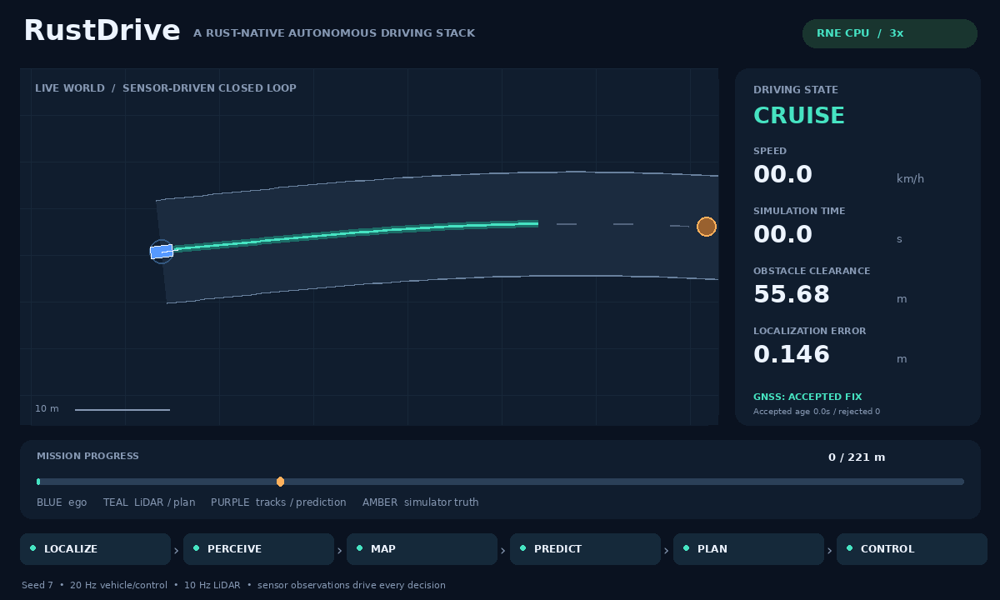

# GNSS innovation gating, accepted-age braking and recovery

RustDriving now gates GNSS corrections with the full two-dimensional innovation covariance, reports observation receipt separately from acceptance, and verifies single-fix rejection, sustained-fault stopping and recovery in both CPU simulators. The existing freshness threshold remains 0.75 s since the **last accepted** fix. This is a bounded sensor-fault experiment, not GNSS-denied navigation or general relocalization.



This GIF records RNE dynamic seed 7 on `gnss-burst`: a three-second position bias is rejected, the vehicle brakes and stops, an unbiased fix is accepted at 8 s, and driving resumes to the destination. The HUD shows the last correction decision, accepted-fix age and rejection count. Candidate paths are muted during emergency braking because the health guard suppresses their actuation. It is recorded telemetry at 3× playback speed, not a native camera capture.

## Correlated-innovation defect and correction

The baseline `e851c2ac3eb9a0bab7f995c97fa0fb7489400cc5` summed squared residuals divided by each position variance separately. That ignores off-diagonal covariance. A positive-definite position covariance `[[1, 0.99], [0.99, 1]]`, measurement variance 0.02 and residual `(1, -1)` gives a diagonal statistic of **1.961**, but a joint statistic of **66.667**. The old gate accepted it despite the unchanged rejection threshold of 36. A regression reproduces that acceptance before the repair and now checks rejection without pose, covariance or accepted-time mutation. An innovation aligned with the high-variance direction remains accepted.

The correction computes `S = H P Hᵀ + R` and `NIS = residualᵀ S⁻¹ residual` using two-dimensional LDLᵀ whitening. It avoids an explicit determinant/inverse in production and includes the x/y covariance. The threshold remains **NIS ≤36**; it is a heuristic bound, not a calibrated probability of localization failure. Independent scalar x/y corrections then use Joseph covariance updates. A separate dense joint-update calculation checks the posterior pose/covariance; numeric tests cover very large finite variances and overflowing innovation statistics.

`Ekf::correct` distinguishes accepted, rejected-innovation, invalid and ignored-timestamp results. Valid new fixes advance the observed timestamp even when rejected. Duplicate or older timestamps cannot subsequently replace that decision. Only acceptance advances the accepted timestamp. `PipelineOutput.localization` reports the last observed and accepted stamps, last valid-new-fix decision, optional finite NIS, and accepted/rejected counters. Invalid input still uses the existing health diagnostics. Rejection does not apply a partial position or yaw correction.

A single rejected fix does not immediately trigger the GNSS health brake while the accepted fix remains fresh. Sustained rejection expires accepted freshness and emits the existing emergency command. A new good fix can restore normal operation without resetting pose, tracks, navigation or occupancy. All emergency commands now clear controller feedback and align its steering reference with the emitted zero command, so the first normal command obeys the existing 0.7 rad/s steering rate. This establishes commanded continuity in the tests, not actual tire-state tracking.

## Fault fixtures and independent checks

The three positive fixtures share a curved 220 m road and one static circular obstacle at route coordinate 58 m. They use the existing sensor noise, plant settings, cruise defaults and collision/road criteria. Each requests a fixed GNSS offset of `(30, -25)` m:

| Fixture | Half-open fault window (s) | Expected result |
|---|---|---|
| `gnss-spike` | [5.0, 5.2) | Reject one fix, no GNSS-stale brake, reach goal |
| `gnss-burst` | [5.0, 8.0) | Reject 15 fixes, physically stop, accept a good fix and reach goal |
| `gnss-persistent-bias` | [5.0, 30.0), episode ends at 20 s | Reject 76 fixes and remain stopped |

`gnss_bias_windows` is simulator-only fault configuration. The shared evaluation loop adds the offset to new GNSS observations using their acquisition stamps; neither pipeline configuration nor replay receives fault labels. Windows are finite, sorted and non-overlapping. Their end may extend beyond the episode, preserving a persistent fault at the terminal tick.

The Python checker compares recorded GNSS against independent evaluation truth and the bounded ±0.14 m sensor noise, confirms each biased observation is rejected, recomputes counters and accepted age, and checks stale braking. On rejected ticks, the estimated position must equal the wheel/gyro prediction rather than jump toward the bad fix. It checks actual standstill before burst recovery, prompt new acceptance, goal completion, zero collision/road violations, complete sensor replay and first-command steering continuity. The new fixtures additionally bound maximum position error to **0.5 m**, with unchanged circular clearance floors of 0.5 m for goal cases and 4 m for persistent stopping.

## GNSS baseline results (2026-10-09, Asia/Tokyo)

The following measurements and [results JSON](gnss-results.json) record revision `e35c483fa6b9d6e33240fc4871b19648d65a768d`. The subsequent [terminal-stopping repair](terminal-stopping.md) supersedes the suite counts and resolves its traffic failure. At this baseline, formatting, Clippy with warnings denied, locked release builds, **109 workspace tests** and **13 RNE tests** pass. The RNE tests include one assertion that the separately retained traffic counterexample fails physical acceptance. The reference script passes eighteen scenario/replay pairs. The suite passes **90 positive scenario runs**, including **18 GNSS-fault runs**, across seeds 1/7/42 and both backends. All positive runs have zero collisions, road violations and closed-edge entry violations, full replay and their prior profile/clearance/normal-steering constraints. The counterexample is recorded separately and is not included in that count. [Complete results, source fingerprint and counterexample](gnss-results.json).

Time and tick counts below use seed 7. Clearance is the minimum and position error the maximum across the three seeds.

| Backend | Fixture | Time (s) | Replay ticks | Worst clearance (m) | Max position error (m) |
|---|---|---:|---:|---:|---:|
| Reference | Spike | 31.50 | 631 | 0.832 | 0.182 |
| Reference | Burst | 35.40 | 709 | 0.721 | 0.182 |
| Reference | Persistent | 20.00 | 401 | 22.326 | 0.182 |
| RNE dynamic | Spike | 39.75 | 796 | 0.930 | 0.246 |
| RNE dynamic | Burst | 43.05 | 862 | 0.953 | 0.415 |
| RNE dynamic | Persistent | 20.00 | 401 | 28.634 | 0.415 |

Sustained faults trigger GNSS-stale braking at 5.60 s. All three burst seeds accept an unbiased fix at 8.00 s. The RNE seed-7 GIF has 862 replayed ticks and completes at 43.05 s. Its maximum position error is 0.301 m; the 0.415 m table value is the worst of the three seeds. The engine pin remains `df6007aa40315e81d12ae00fc1f60369e393a178`.

## Historical traffic failure at e35c483

The first burst experiment used the existing three-actor mission, preserving its scheduled traffic. In RNE seed 7, GNSS rejection and recovery worked, with 0.301 m maximum position error, but the planner later held near the destination while a scheduled vehicle caught up from behind. The actors do not interact or brake in response to ego. At that revision, this episode had **32 colliding integration ticks**, −1.049 m minimum clearance and no goal completion; the CLI returns **1**. All 1301 sensor ticks still replay. The subsequent terminal-stopping work resolves the original world and verifies an extended post-arrival hold. The historical failure evidence remains in `gnss-results.json`.

The exact compound world remains reproducible as `gnss-burst-traffic`; it was not removed or relabeled successful to obtain the positive suite. The fixed-obstacle fixtures isolate GNSS behavior, and their 90-run count excludes this failing episode. At that baseline the RNE regression and suite separately required that physical acceptance reject it; current tests instead require successful physical completion and post-arrival clearance. The renderer refuses to turn a failing summary into a success demo.

## Reproduce

```sh
bash scripts/check.sh
bash scripts/setup-rne.sh
bash scripts/check-hazards.sh --output artifacts/gnss-verified
# With the documented Pillow environment activated:
python3 scripts/render_demo.py \
  artifacts/gnss-verified/rne-dynamic/gnss-burst/seed-7/run.json \
  --output assets/gnss-demo.gif
# The original traffic world now returns 0 after the terminal-stopping repair:
cargo +1.95.0 run --release --locked --manifest-path integrations/rne/Cargo.toml -- \
  --scenario scenarios/gnss-burst-traffic.json --plant dynamic --seed 7 \
  --output artifacts/gnss-burst-traffic
```

The previous filter already rejected very large outliers; this work repairs its correlated gate, exposes acceptance diagnostics and verifies the stopping/recovery contract. Slowly varying biases within the gate, erroneous sensor covariance, delayed-sensing compensation, extended GNSS denial, automatic relocalization and interactive traffic remain unresolved. Sensor schema 1 remains readable, but the changed correction/diagnostic outputs require fresh recordings for exact replay. Boxed replay-record payloads do not change the JSON encoding. No real-time or real-vehicle result is claimed.
