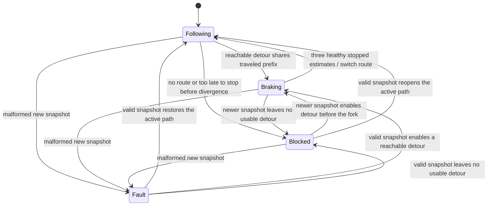

# Live closure updates and stopped route handover

This page records the `cc9ba4d` baseline, including its retained 6 m/s failure. The [current avoidance extension](avoidance-continuity.md) repairs that regression, expands the suite and supplies the current README GIF; its results supersede the measurements below.

RustDriving now receives known road-closure snapshots while driving, stops before a divergent or closed edge, and switches to a detour after three healthy stopped estimates. If no route remains, it holds on the existing corridor. A later snapshot that makes the detour available permits a stopped handover and resumed driving. The GIF at that revision was the actual seed-7 CPU-only RNE dynamic run, rendered from telemetry at 3× speed.

This is a deliberately restricted handover policy for authored planar maps. It does not implement continuous rerouting at speed, traffic-light logic, intersection priority or physical road-closure perception.

## Input and state contract

`PipelineConfig.navigation` optionally records the complete directed map, original start, destination and initial closed edge IDs. Construction verifies its initial Dijkstra route matches `PipelineConfig.route`. Existing resolved-route configurations without this field retain their previous behavior.

`SensorFrame.navigation_update` optionally contains `{stamp, revision, closed_edges}`. It is a complete externally supplied closure snapshot on the same clock as sensing. Revisions start above zero and accepted revision/stamp pairs increase strictly. Duplicate or reordered snapshots cannot roll back an accepted decision. A new snapshot with unknown edges, a non-finite/future timestamp or more than one second of delivery age latches `Fault` and `InvalidNavigation` braking. A subsequently valid newer snapshot can clear that fault. Updates on a pipeline without a map produce an invalid-navigation diagnostic and brake that frame.

The simulator delivers authored `navigation_updates` once, at the first 20 Hz tick at or after their timestamps. It does not infer them from world objects or truth poses. The navigator uses the EKF estimate and configured map; no simulator state enters its route decision.



Every valid snapshot reruns Dijkstra from the original start. Equal routes continue without a handover. For a changed route, the navigator finds the common edge prefix and the first closed edge on the active route. The earlier boundary sets a stop target `vehicle_radius + 2 m` before it. The local planner receives a truncated corridor, so its existing reachable speed profile, obstacle sweeps and stationary hold perform the stop. The one-meter goal buffer remains in that planner; the truncated endpoint accounts for it.

A moving request must have at least its nominal braking distance plus a meter of reserve before the target. An already stopped estimate within 0.5 m of the target may also accept a newly available detour. A narrower-than-vehicle or oversized candidate cannot be activated. Handover then requires three consecutive sensor-healthy estimates with absolute speed ≤0.05 m/s, sufficient corridor clearance, heading alignment within 0.35 rad and position before the stop-target tolerance. Late or unreachable requests stay on the old path and continue braking/holding; they never teleport to a passed branch.

The pipeline preserves localization, covariance, sensor ages, tracks and occupancy. Only the lattice maneuver state and longitudinal controller feedback reset. The controller retains its last steering command, maintaining the existing 0.7 rad/s normal-command rate limit across a handover. The occupancy grid is initially sized for the supplied map and capped at four million cells; excessive map extent returns an error.

## Fixtures and independent acceptance

All three new fixtures use the existing five-node map and a fixed world object at `(100, 20)` m. Its position remains tied to the **initial** road and does not move when navigation changes. This differs from comparing separate pre-departure scenarios whose objects are authored on each selected route.

| Fixture | Delivered snapshots | Expected outcome |
|---|---|---|
| `route-handover` | At 3 s: close `main` | Stop before fork, activate detour, reach east |
| `route-no-path` | At 3 s: close `main` and `detour` | Hold before fork; no route switch |
| `route-reopen` | At 3 s: close both; at 15 s: retain only `main` closure | Hold, then activate reopened detour and reach east |

The fixtures explicitly request 4 m/s cruise, 2 m/s² forward acceleration, 2.5 m/s² braking and 1 m/s² planned lateral acceleration. These are conservative planning settings, not measured real-vehicle calibration. Other existing scenarios retain their prior defaults. Optional scenario `motion_limits` and `cruise_speed` are validated; RNE's explicit friction calibration further caps requested planning limits rather than increasing them.

Physical evaluation still checks swept circular collision, the active road corridor and goal completion. It additionally checks external delivered closures independently of the navigator's reported closure list: a circular body may not progress into a closed edge on its active path. These entry checks are sampled at evaluated ticks, not a complete traffic-rule or shared-intersection evaluator. The report records true/estimated speed at route changes and the route history. Python independently checks delivered snapshots, reported revisions, exclusion of closed edges in following/pending paths, three stopped healthy estimates, actual switch speed ≤0.1 m/s, fixed world geometry, destination arrival and the no-route hold. Full sensor replay recomputes map search, navigation transitions and every local-stack output for map-configured logs.

## Measured results

Local formatting, Clippy with warnings denied, locked release builds and **97 workspace tests** pass. The reference check script passes fourteen scenario/replay pairs. **11 RNE tests** pass, including one assertion that the separately documented unbounded-curvature mission below fails physical goal acceptance. That negative mission is not counted as a successful driving run.

The positive suite passes **66 runs**, including **18 live-navigation runs**, across seeds 1/7/42 and both backends. Every positive run has zero collisions, road violations and closed-edge entry violations, full replay, valid profile kinematics and its unchanged clearance/normal steering-rate constraints. The new successful live-route fixtures require at least 0.5 m minimum clearance. The no-route fixture keeps a 4 m obstacle-clearance floor in addition to holding before the closed fork. [Full result snapshot](handover-results.json).

Times, tick counts and handover times below use seed 7. Clearance is the minimum across three seeds for that row.

| Backend | Fixture | Time (s) | Replay ticks | Handover (s) | Worst clearance (m) |
|---|---|---:|---:|---:|---:|
| Reference | Handover | 55.95 | 1120 | 11.40 | 0.645 |
| Reference | No route | 20.00 | 401 | — | 64.007 |
| Reference | Reopened detour | 59.75 | 1196 | 15.10 | 0.668 |
| RNE dynamic | Handover | 57.20 | 1145 | 11.30 | 0.537 |
| RNE dynamic | No route | 20.00 | 401 | — | 64.015 |
| RNE dynamic | Reopened detour | 59.75 | 1196 | 15.10 | 0.731 |

At the RNE seed-7 handover, estimated speed is 0.0142 m/s and actual speed is 0.0108 m/s. The reopened-detour handover is at zero actual speed. These verify the stated thresholds, not exact standstill on every run or general route feasibility.

New tests cover stopped/healthy handover requirements, duplicate and reordered snapshots, malformed-update fault persistence/recovery, unreachable/late/narrow routes, off-corridor or misaligned stopped estimates, localization retention, map mismatch/allocation bounds, changed-snapshot replay detection, control continuity, seeded physical handover/reopening and no-route holding. A separate late-closure test delivers the notification after entering the branch and confirms physical acceptance fails and the route is never switched.

## Reproduce

```sh
bash scripts/check.sh
bash scripts/setup-rne.sh
bash scripts/check-hazards.sh
# Activate a Pillow environment to render this baseline fixture.
bash scripts/rne-demo.sh dynamic artifacts/handover-demo.gif scenarios/route-handover.json
```

The map inset displays the current active route, purple pending route, accepted orange closures and navigation phase. Route history determines the displayed corridor and progress denominator for each frame; it does not draw the eventual detour before the update arrives. Map colors are known navigation information; they are not synthetic sensor detections.

## Retained failure and remaining boundaries

At `cc9ba4d`, a seed-7 RNE run at **6 m/s with `motion_limits` omitted** switched routes but stopped near the curve's object until the 70 s duration ends. It has zero colliding/road-violation ticks and 0.952 m minimum clearance, but does **not** reach the goal; the CLI returns 1. Its 1401 sensor ticks replay successfully, demonstrating why replay and physical acceptance remain distinct. The snapshot preserves this failed summary; the RNE regression at that revision asserted the physical failure. The demonstrated 4 m/s fixtures enable conservative curvature bounds; this higher-speed case was unresolved at that revision. The newer avoidance policy repairs this particular regression without changing its speed, world or acceptance conditions.

At `cc9ba4d`, reproduce the failure without changing any acceptance condition (the current planner reaches the goal):

```sh
mkdir -p artifacts
python3 - <<'PY'
import json
from pathlib import Path
s = json.loads(Path('scenarios/route-handover.json').read_text())
s['cruise_speed'] = 6.0
s.pop('motion_limits')
Path('artifacts/handover-unlimited.json').write_text(json.dumps(s))
PY
cargo +1.95.0 run --release --locked --manifest-path integrations/rne/Cargo.toml -- \
  --scenario artifacts/handover-unlimited.json --plant dynamic --seed 7 \
  --output artifacts/handover-unlimited
# Expected exit 1: goal not reached. The evidence is still written.
```

The current policy needs a usable common prefix before the divergence. It does not route from an arbitrary mid-edge position, recover from passed branches, change destinations, replace map geometry or guarantee a late notification can be obeyed. A notification arriving after entering a closed edge is correctly a failed episode even if braking then stops the vehicle. Map import, lane topology, signals, priority rules, interactive traffic and combined tire-force feasibility remain future work. The opening GIF uses recorded CPU RNE telemetry, not a native engine camera or CARLA.
