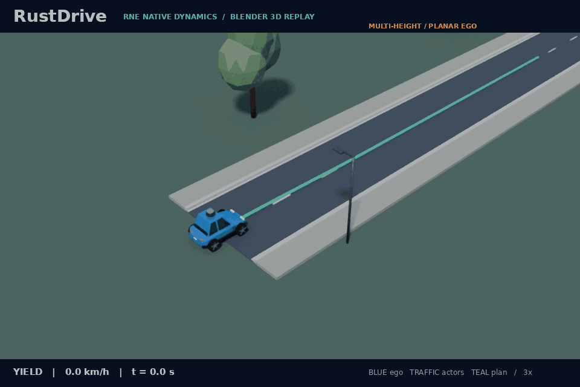

# Measured multi-height LiDAR

The optional native `--multi-height` mode sends measured returns from three horizontal LiDAR sweeps to the shared RustDriving pipeline. A calibrated height gate keeps the low and main planes for obstacle detection and excludes returns above the vehicle's configured collision envelope. This allows the existing planar driving stack to detect the 0.2 m high slab that its single 0.6 m scan misses.

The implementation is **height-gated projection into a 2D obstacle pipeline**. It does not infer object heights, build a volumetric map, perform general 3D perception or add suspension/contact response. Scene cuboids and simulator truth remain outside driving inputs. The low plane is an actual native Rapier measurement, rather than an obstacle injected from scene labels.

## Run and replay

Use the development branch and the existing [CPU-only RNE setup](../README.md#cpu-only-robot-native-engine-demo).

```sh
source scripts/env.sh
bash scripts/setup-rne.sh
cargo +1.95.0 run --release --locked \
  --manifest-path integrations/rne/Cargo.toml -- \
  --scenario scenarios/native-scene-low-stop.json \
  --scene scenes/blind-low-slab.json --multi-height \
  --plant dynamic --seed 7 --output artifacts/multi-height-low
cargo run --release --locked --bin rustdriving -- replay \
  --log artifacts/multi-height-low/sensors.jsonl \
  --output artifacts/multi-height-low/replay
python3 scripts/check-native-scenes.py \
  --output artifacts/multi-height-scenes
```

`--multi-height` requires `--scene`. The adapter records `run.json`, `summary.json`, sensor-only `sensors.jsonl` and the independent physical-scene sidecar `scene.json`. The sensor log contains raw measured planes, not a pre-fused obstacle list. Replay reconstructs the height gate, projection, clustering, localization, tracking, prediction, planning and commands from those measurements and the logged calibration.

Omitting `--multi-height` retains the preceding single-plane mode. Its original low-slab failure remains a required negative fixture. The new expected-stop scenario is separate; the original expected-goal failure's bytes and physical geometry are preserved. [Earlier native scene contract and its limits](native-scenes.md).

## Sensor and calibration contract

`SensorFrame.multi_height_lidar` is an optional synchronized bundle:

```json
{
  "stamp": 1.2,
  "planes": [
    {"height_m": 0.15, "points": [{"x": 12.0, "y": 0.2}]},
    {"height_m": 0.6, "points": []},
    {"height_m": 3.7, "points": []}
  ]
}
```

This example illustrates the wire format, not a recorded sensor acquisition. `x` is body forward and `y` is body left, in meters. `height_m` is a known mounting height above the calibrated road datum, not an inferred object label. All planes share one acquisition timestamp and planar origin. The current native adapter assumes horizontal sweeps over a flat road with yaw-only ego orientation; it does not calibrate arbitrary pitched/rolled sensors or independent extrinsics.

The pipeline header's optional `multi_height_lidar` configuration contains `heights_m`, `collision_bottom_m` and `collision_top_m`. The native adapter supplies heights **0.6, 0.15 and 3.7 m**. Its collision interval follows the existing virtual ego capsule: axis heights 0.1–1.1 m, expanded by the recorded radius. With the usual 1.25 m radius the interval is **−1.15–2.35 m**. This unusual lower bound reflects the simulator's uncalibrated capsule, which extends below the displayed ground; it is not a physical car-body calibration or a ground-removal rule.

The low 0.15 m and main 0.6 m planes fall inside that interval. The 3.7 m plane remains measured and logged, and is validated, but its points are excluded from the projected obstacle cloud. A raised cuboid whose bottom is 3.5 m can therefore be observed by the high plane without being treated as a planar road blockage. Clearance against its actual height is still checked independently by the physical-scene evaluator.

Calibration accepts two to 16 distinct heights within −5 to 10 m, with at least 0.01 m separation, a finite collision interval within the same bounds and at least 0.1 m thick, and at least one relevant plane. Every acquisition must contain the complete calibrated plane set, with height agreement within 10⁻⁹ m. Every point—including points in excluded overhead planes—must be finite, within 200 m planar range, and within the aggregate **20,000-return** bound. Missing, duplicated, unknown or malformed planes are rejected before projection.

After validation, relevance and ordering use the matched canonical calibration heights, so an accepted label tolerance cannot change whether a boundary plane is included. Relevant planes are sorted by increasing calibrated height. The pipeline retains the first measured point in each **5 cm** body-XY voxel, then feeds the resulting `LidarScan` to its ordinary 2D clustering and tracking path. No scene dimensions, actor identity or simulator pose participates in that fusion. The occupancy map remains a planar grid, and the planner retains circular footprints and planar trajectories.

## Timing and failure behavior

The complete bundle is acquired, delayed, delivered or dropped atomically. All its returns refer to the same acquisition stamp; the pipeline never combines independently aged plane scans. The existing bounded EKF pose history transforms the merged body-frame cloud at acquisition time. Acquired track stamps remain unchanged and prediction separately advances observations to the current planning time.

Future stamps beyond the numerical clock tolerance, non-finite stamps and negative stamps are invalid. New scans outside the covered acquisition-pose history are rejected; the history permits at most 0.35 s age and does not extrapolate an unavailable pose. Duplicate or older stamps cannot refresh sensor freshness. A missing bundle between scheduled acquisitions is allowed until the usual **0.35 s** LiDAR timeout. An adapter acquisition failure sets `lidar_failed` and causes braking immediately, rather than substituting a partial or empty healthy scan. A complete acquisition with no returns is valid and differs from a missing acquisition.

In calibrated multi-height mode, acquisition failures, malformed bundles and invalid input-mode combinations latch the fault at the current control time. Braking persists through absent, duplicate and delayed pre-fault bundles. Only a complete valid acquisition with a covered pose and a stamp strictly newer than both the fault time and the last accepted acquisition clears it. A still-fresh earlier scan cannot make a failed multi-plane acquisition healthy on the next tick. This latch is specific to the opt-in mode; it does not change the preceding ordinary scan path.

The pipeline rejects a bundle without calibration, an ordinary scan in calibrated multi-height mode, or simultaneous ordinary and multi-height inputs. Optional fields default to absent and are omitted from serialization when unused, preserving the preceding single-plane log path. This adds an explicit observation/configuration option rather than making a new runtime or transport mandatory.

## Independent acceptance and remaining blind zones

The complete local matrix passed: **42 positive episodes and 12 required rejections**, across both native plants and seeds 1, 7 and 42. It includes the preceding physical-scene cases, their multi-height variants, the newly detected low slab, the original primary-only low-slab failures, and a new sub-low blind obstacle. The independent checker reconstructs native nearest-ray returns and the complete raw plane bundle from sidecar acquisition evidence, reconstructs height-eligible returns and expected voxel counts, checks sensor-only replay, and retains the physical capsule-clearance floor and speed-profile gates. [Compact result asset](../assets/multi-height-results.json) records the final matrix and exact source/input hashes.

The six repaired low-slab episodes retained at least **7.391197 m** physical capsule-guard clearance. All 24 preceding default-mode outputs—including retained failures—matched the archived recordings byte for byte. Across the entire new matrix, the independent oracle checked 314,174 motion samples, 15,754 acquisitions and 1,476,092 returned rays.

The independent oracle rejected 72 geometry mutations and 50 raw-layer mutations. Rust sensor replay rejected 46 of the 50 raw-layer mutations; four point changes left driving outputs unchanged because they affected excluded overhead returns or isolated points below the clustering minimum. Those changes were still rejected by the independent measurement oracle. Reproducible pipeline outputs alone do not establish that sensor inputs match the physical recording.

The new sub-low cuboid is 0.1 m high, with center height 0.05 m. Its top lies below the lowest 0.15 m scan. Even multi-height sensing misses it, while the simulator capsule intersects it; physical acceptance must reject that run. Obstacles between the sampled heights can likewise remain invisible. A calibrated inclusion interval does not establish sensor coverage throughout that interval, and height metadata does not supply object-height semantics.

These are authored flat-road simulation fixtures, not coverage of arbitrary 3D obstacles, road elevations, weather or real sensors. The next extension needs additional measured coverage and an explicit independent acceptance case for any claimed blind-zone improvement.

A separate opt-in [inclined XYZ acquisition](lidar-3d.md) now supplies actual 16-ring native measurements and repairs authored between-plane and sub-low cases through validated planar projection. It preserves this horizontal mode and its existing failures; finite inclined elevation coverage and ground segmentation remain separate limitations. The matrix above records this preceding horizontal implementation, rather than the newer XYZ matrix.

## Audited 3D replay



The published dynamic-plant episode uses seed 7 and retains the full **35 seconds / 701 sensor ticks**. The 0.6 m plane has no slab returns; the measured 0.15 m plane supplies **23,474 returns** over the episode. Ego stops with **7.391502 m** minimum physical capsule-guard clearance, zero overlaps, nine emergency ticks and zero final speed. No goal arrival is claimed: this fixture expects a stop before the blocked road.

The GIF contains **118 audited states / 118 encoded frames**, at 960 × 640 pixels and 3× playback with a final pause. It uses eight Cycles CPU samples and three threads, and is 1.60 MB. All 351 recorded trace poses and 118 physical-cuboid mesh states are checked. [Exact GIF provenance](../assets/multi-height-demo.json) records all three measured heights, the selected 0.15/0.6 m projection planes, the collision-height interval and source/input SHA-256 values.

The existing renderer can display the actual low cuboid using the generated physical-scene sidecar:

```sh
python3 scripts/render_demo_3d.py artifacts/multi-height-low/run.json \
  --native-scene artifacts/multi-height-low/scene.json \
  --output artifacts/multi-height-low/demo.gif --samples 8 --threads 3
```

The orange slab uses its actual 0.2 m height, center, dimensions and yaw; no display height exaggeration is applied. Native ego motion remains planar. Every displayed body pose and the actual Blender cuboid mesh corners are checked against the accepted recording, and GIF provenance hashes the trace, scene evidence and renderer sources. Rendering never enters sensing or changes driving commands.
