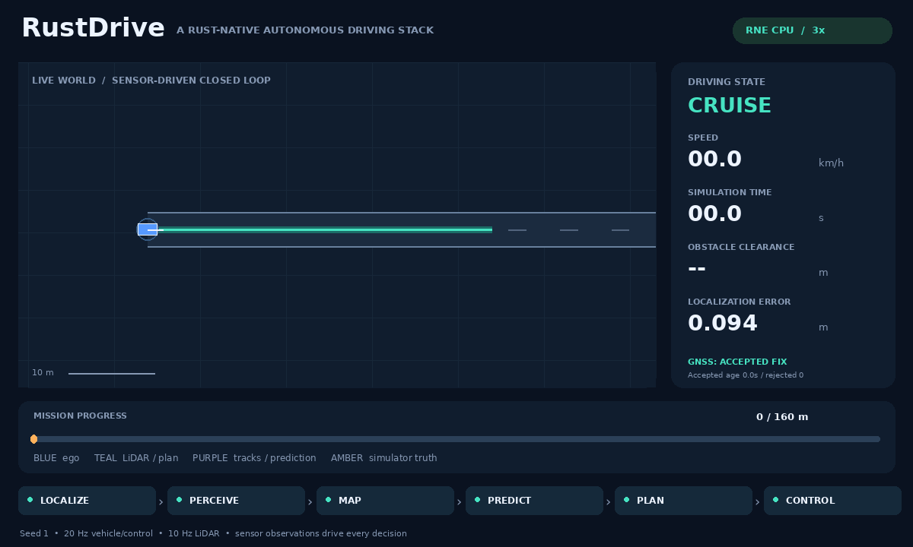

# Observed braking and the repaired follower deadline

RustDriving now forecasts a short continuation of **measured** obstacle braking instead of extending the latest velocity unchanged. The unchanged `traffic-follower-deadline` fixture completes its eight-second goal residence within 65 seconds in both plants across seeds 1/7/42. The original world, GNSS fault [10,14), plant, engine revision and physical acceptance remain unchanged. All eight seconds of stationary collision checking and the 1 m clearance floor remain mandatory.



This is actual RNE dynamic seed 1 telemetry, rendered top-down at 3× playback speed. It includes the GNSS-induced stop, recovery, repeated conservative terminal stops and the complete eight-second goal residence. RNE integrates ego and supplies Rapier LiDAR; the reactive follower still uses the shared one-dimensional simulator integrator. This is not a camera recording or a fully native traffic vehicle model.

## Observation boundary and model

`ObservedBraking` consumes only sensor-derived `Track` values and the pipeline clock. It has no simulator body identities, actor acceleration commands, following parameters, stop schedules, ego commands or future trajectories. The existing constant-velocity implementation remains available as a baseline. The shared pipeline owns a fresh predictor instance, and replay reconstructs its history solely by rerunning accepted observations.

Each present track retains at most 0.8 seconds / 32 samples. A duplicate timestamp cannot extend evidence; an absent track loses history. Three consecutive 0.2-second observation intervals must each show at least 0.3 m/s² deceleration. Historical velocity directions must agree with the current direction by a cosine of at least 0.98; nearby samples must match each requested timestamp within 25 ms. This deliberately targets the current 10 Hz tracking schedule, not arbitrary delayed sensing.

The forecast applies half the weakest observed deceleration, capped at 2 m/s², for **at most one second**, then coasts at the reduced speed. It stops before reversing. It does not assume that another driver will continue braking through the complete eight-second horizon. Fresh non-decreasing speed, insufficient history, direction changes, observation age over 0.15 seconds or unsupported observation gaps select the unchanged constant-velocity baseline. The existing 0.7 m/s deadband, 0.2-second forecast spacing, eight-second horizon and planner uncertainty margin are unchanged.

The model is one hypothesis of observed motion, not an interaction-aware behavior model or a certified upper bound on occupied space. Unobserved reacceleration can invalidate it before the next sensor update. Multiple hypotheses, calibrated motion uncertainty and forecast-error validation remain future work.

## Independent verification

The Python checker reads sensor logs and checks sustained measured deceleration, fresh decreasing-speed support, no invented lateral motion, no reverse or accelerated forecast motion, bounded deceleration and constant forecast speed after one second. It also checks immediate fallback on observed reacceleration. Each repaired deadline run must actually exercise braking forecasts; a positive CLI result alone is insufficient.

Physical evaluation remains separate: swept ego/traffic circles, route/closure containment, the original per-fixture clearance floors, reachable trajectory kinematics, normal steering-rate gates, physical stop/recovery and complete goal residence. Every sensor tick is recomputed from a fresh pipeline. Unit tests cover insufficient history, duplicate/stale/reacquired tracks, direction changes and first observed reacceleration. Existing negative actor-collision and endpoint-overrun checks remain intact.

## Measured results (2026-10-09 UTC)

Local formatting, Clippy with warnings denied, locked release builds, **128 workspace tests** and **16 RNE tests** pass. The reference script passes **24 scenario/replay pairs**. All **126 positive runs** pass (60 reference and 66 RNE), including the preceding 120 cases and six promoted short-deadline cases. They include 24 live-navigation, 42 GNSS-fault and 24 reactive-traffic runs; these categories overlap. Every positive run passes full replay and its unchanged physical gates. [Complete compact evidence and source fingerprint](prediction-results.json).

The following RNE results use the original 65-second deadline fixture. Emergency counts include accepted-GNSS freshness braking and planner fallback; they are not a comfort metric.

| Seed | Previous outcome at `4620878` | Current time (s) | Current minimum clearance (m) | Previous / current emergency ticks |
|---|---|---:|---:|---:|
| 1 | Residence deadline missed at 65 s | 64.25 | 3.000 | 259 / 237 |
| 7 | Not included in the committed failure snapshot | 64.55 | 2.997 | — / 244 |
| 42 | Residence deadline missed at 65 s | 64.10 | 2.997 | 261 / 247 |

The measured RNE completion margins are only 0.45–0.90 seconds. The original two failed outcomes remain unchanged in [historical traffic results](traffic-results.json). They are not relabeled as past successes. The native regression now requires genuine physical success on the same fixture, including eight seconds of residence. This repairs the authored deadline, not terminal behavior generally: many conservative emergency ticks remain.

## Retained physical failure: insufficient follower range

`traffic-follower-short-range` changes only the follower's sensing range from 45 to **5 m** relative to the original deadline world, apart from its display name. In RNE seeds 1 and 42 it remains collision-free, but minimum swept clearance is **0.392 / 0.443 m**, below the unchanged 1 m floor, and the goal is not reached. The CLI returns **1**, all 1301 ticks replay and the suite independently requires clearance rejection. These two failures are excluded from the 126 positive runs. They show that better ego motion forecasting cannot repair inadequate follower sensing. Neither the clearance floor nor the actor's physical state is clamped to hide the failure.

## Reproduce

```sh
bash scripts/check.sh
bash scripts/setup-rne.sh
bash scripts/check-hazards.sh --output artifacts/braking-verified
# Activate the documented Pillow environment first:
python3 scripts/render_demo.py \
  artifacts/braking-verified/rne-dynamic/traffic-follower-deadline/seed-1/run.json \
  --output assets/prediction-demo.gif
# This retained clearance failure returns 1:
cargo +1.95.0 run --release --locked --manifest-path integrations/rne/Cargo.toml -- \
  --scenario scenarios/traffic-follower-short-range.json --plant dynamic --seed 1 \
  --output artifacts/follower-short-range
```

The engine remains pinned to `df6007aa40315e81d12ae00fc1f60369e393a178`. The README opening GIF remains an actual RNE mapped-route run. Authored circular actors and sensor-only replay do not establish traffic-rule compliance, robust forecasting, real-time performance or real-vehicle safety.
