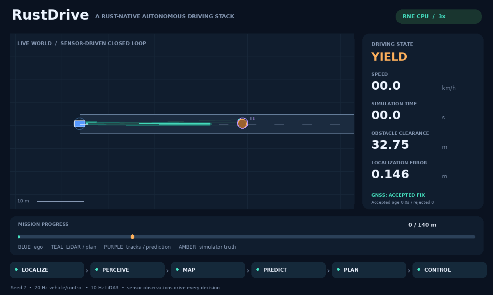

# Reactive traffic baseline, stopped leads and queues

This page records the reactive-traffic baseline at `4620878`, including its two genuine deadline failures. Its compact results remain unchanged. The [observed-braking extension](observed-braking.md) supersedes the current forecast, run counts and deadline outcomes while preserving the original fixture and acceptance criteria.

The later [urban road-user demo](road-users.md) adds opt-in timestamped
infrastructure signal control to forward-lane actors, and `moving_until` to end
prescribed pedestrian crossings at the far footpath. The baseline below used
neither option. Both fields default to absent and retain legacy serialization
and behavior. Neither provides semantic visual recognition or human intent.

RustDriving now has a stateful simulator traffic world shared by the reference and CPU-only RNE adapters. Optional route-following actors adjust speed from finite-range proximity observations. The ego vehicle continues to run the unchanged sensor-only localization, perception, prediction, planning and control pipeline. Existing analytic scheduled actors and all 102 preceding positive scenarios are retained.



This GIF is recorded RNE dynamic seed 7 on `traffic-lead-stop`, rendered top-down at 3× speed. The lead stops between 8 and 24 seconds; ego stops behind it, waits and resumes. Both eventually stop before the road endpoint. This fixture expects a blocked-road **stop**, not goal completion. RNE integrates the ego natively and supplies Rapier LiDAR queries; reactive actors use the shared one-dimensional traffic integrator, not RNE tire/contact dynamics. The engine pin remains `df6007aa40315e81d12ae00fc1f60369e393a178`.

## Actor model and sensing boundary

`ObjectSpec.following` is optional. Without it, analytic scheduled motion, activation and delayed motion remain unchanged. With it, `speed` is the desired forward speed and `initial_speed_m_s` initializes the actor. Defaults are a 3 m minimum gap, 1.5 s headway, 2 m/s² forward authority, 2 m/s² comfortable deceleration, 4 m/s² maximum deceleration and 45 m sensor range. Only fixed lateral offsets and forward route following at desired speeds 0.1–12 m/s are supported. Reactive delayed motion (`moving_from > active_from`) is rejected rather than reporting a nonzero initial speed on a body held stationary; use stop windows for waiting. Sorted non-overlapping `stop_windows` lower the actor's own target to zero and release it after the window. They are not delivered to ego or used as prediction hints.

The simulator synthesizes an ideal route-aligned proximity observation: the nearest circular body ahead whose lateral envelopes overlap, or the route endpoint, within sensor range. It reports only scalar gap and range-change closing speed. First acquisition assumes a stationary lead conservatively; later closing speed comes from consecutive measured gaps, bounded to ±12 m/s. There are no object identities, ego commands, planned trajectories, opponent velocities or other actors’ future motion schedules in the actor policy input. Sensor synthesis itself uses simulator geometry, as ego sensor synthesis does. This ideal sensor can follow the supplied route around bends; it is not an actor-mounted LiDAR, radar implementation or line-of-sight perception stack.

The longitudinal policy is IDM-style: free acceleration `a * (1 - (v / desired_speed)^4)` minus `a * (desired_gap / measured_gap)^2`, with `desired_gap = minimum_gap + max(0, v * headway + v * closing_speed / (2 * sqrt(a * comfortable_braking)))`. Stop-window free braking uses the calibrated comfortable deceleration. Commands are bounded by the actor's acceleration/braking authority; speed integrates at 20 Hz and distance uses trapezoidal integration. All actors observe the same pre-step scene, so update order cannot give a later actor access to already moved bodies.

No gap or position correction teleports an actor out of collision. An actor unable to stop can collide. Reactive actors that overrun the route extrapolate along its final tangent rather than being silently clamped at the endpoint; physical acceptance rejects the overrun. Scheduled actors retain their existing endpoint clamp. The constructor is used after scenario validation; malformed numeric calibration and stop schedules are rejected before a run.

## Fixtures and acceptance

| Fixture | World and required behavior |
|---|---|
| `traffic-lead-stop` | 140 m straight narrow corridor; 4 m/s lead starts at 35 m, stops during [8,24), then resumes. Ego must wait at least two seconds and subsequently advance, ending in a blocked-road stop. |
| `traffic-follower-brake` | 160 m narrow corridor; 6 m/s desired-speed follower activates behind ego at 6 s. A GNSS bias during [10,20) makes ego brake and physically stop; the follower must also stop, then both resume. An 80 s episode permits the full eight-second post-arrival residence. |
| `traffic-queue` | Two 4 m/s reactive actors start at 30 and 60 m behind a static body at 95 m. They form a stopped queue, and ego stops behind it. All participant separation is checked. |

Each positive fixture uses a fixed **1 m** ego clearance floor. The same floor additionally applies to every actor pair involving a reactive actor. Circular sweeps score those pairs independently and report `traffic_collisions` / `traffic_min_clearance`; endpoint/corridor failures report `traffic_road_violations`. Scheduled-only pair interactions remain outside this new criterion, preserving the earlier authored crossing fixtures. This is not a rectangular collision/contact-response model.

Reactive cases record every 20 Hz truth tick in `run.json`, including actor state and the preceding observation/command. This telemetry is absent from `sensors.jsonl`, whose header contains no actors, following parameters or stop schedules. Full replay still reconstructs every ego output only from its sensor observations.

The independent Python checker reconstructs proximity observations from pre-step truth geometry, reconstructs closing speed from gap differences, checks measured velocity/distance integration without position clamps, and verifies acceleration authority. It separately recomputes actor-pair swept clearance, checks the physical stops/resumption/queue, rejects injected GNSS, and verifies post-arrival residence. A complete reference run with renamed opaque adapter body IDs has identical physical results; evaluator identity is not a scenario-array index. Negative tests prove that insufficient sensing range can cause an actor collision, and that collisions between traffic actors or endpoint overruns fail physical acceptance rather than disappearing behind ego-only scoring.

## Baseline measured results (2026-10-09, Asia/Tokyo)

Local formatting, Clippy with warnings denied, locked builds, **123 workspace tests** and **15 RNE tests** pass. The reference script passes **23 scenario/replay pairs**. All **120 positive runs** (57 reference and 63 RNE) pass across seeds 1/7/42, including 18 new traffic runs and all previous 102 cases. Every positive run has zero ego/traffic collisions, road/closure violations, complete replay and its unchanged prior clearance/profile/normal-steering gates. Two separately retained RNE deadline failures are **not** counted as successful runs. [Complete compact results and source fingerprint](traffic-results.json).

Time, replay counts and emergency ticks below use seed 7. Clearance is the worst across all three seeds. Emergency counts include sensor-freshness braking and planner fallback; they are not a comfort metric.

| Backend | Fixture | Time (s) | Replay ticks | Worst ego clearance (m) | Worst actor-pair clearance (m) | Emergency ticks |
|---|---|---:|---:|---:|---:|---:|
| reference | `traffic-lead-stop` | 65.00 | 1301 | 4.182 | — | 11 |
| reference | `traffic-follower-brake` | 70.95 | 1420 | 2.995 | — | 375 |
| reference | `traffic-queue` | 65.00 | 1301 | 4.545 | 2.996 | 10 |
| rne-dynamic | `traffic-lead-stop` | 65.00 | 1301 | 4.261 | — | 19 |
| rne-dynamic | `traffic-follower-brake` | 70.80 | 1417 | 2.995 | — | 372 |
| rne-dynamic | `traffic-queue` | 65.00 | 1301 | 4.528 | 2.996 | 16 |

## Retained limitation: conservative terminal behavior

The ego predictor remains constant velocity and does not know that a follower will brake. In a narrow corridor, it can reject all stop/hold candidates because a moving rear forecast intersects the stationary hold. Repeated emergency stops near the endpoint remain visible in the new follower runs; neither the eight-second sweep nor its margins were weakened. The actor's real response prevents collision, but this does not make the ego behavior smooth or interaction-aware.

The original shorter trial is preserved as `traffic-follower-deadline`: fault window [10,14), episode limit 65 s and eight-second residence. RNE seeds 1 and 42 remain collision-free but do not finish the required residence before the deadline. The CLI returns **1** and all 1301 ticks still replay; the suite and a native regression require explicit physical rejection. The longer positive case has **different** fault and evaluation durations to exercise an actual follower standstill; it does not repair or relabel the 65-second failure. Its original world, timing and criteria are kept unchanged in the retained fixture. `traffic-results.json` records both outcomes separately.

## Reproduce

These commands describe the baseline. Its deadline command returns 1 on `4620878`; the current implementation repairs that outcome. Use [current commands and results](observed-braking.md) when developing on the latest branch.

```sh
bash scripts/check.sh
bash scripts/setup-rne.sh
bash scripts/check-hazards.sh --output artifacts/traffic-verified
# Activate the documented Pillow environment first:
python3 scripts/render_demo.py \
  artifacts/traffic-verified/rne-dynamic/traffic-lead-stop/seed-7/run.json \
  --output assets/traffic-demo.gif
# The retained deadline case returns 1:
cargo +1.95.0 run --release --locked --manifest-path integrations/rne/Cargo.toml -- \
  --scenario scenarios/traffic-follower-deadline.json --plant dynamic --seed 1 \
  --output artifacts/traffic-deadline
```

## Limits and next work

Actors have ideal finite-range proximity sensing and one-dimensional route motion. They do not steer, change lanes, negotiate priority, perceive signals, estimate noisy sensors, obey tire friction or exchange intentions. A cut-in or insufficient range can remain physically infeasible, and the evaluator must reject it. Ego interaction-aware prediction/planning and the conservative narrow-corridor terminal failure remain future work. Neither these episodes nor replay establish traffic-rule compliance, indefinite clearance, real-time throughput or real-vehicle safety.
