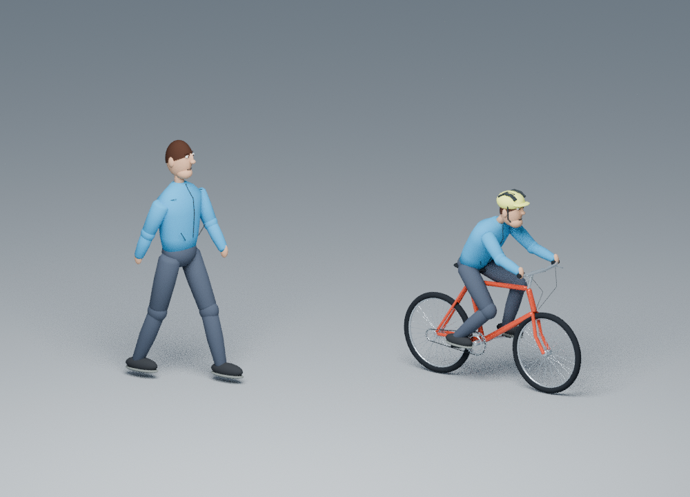
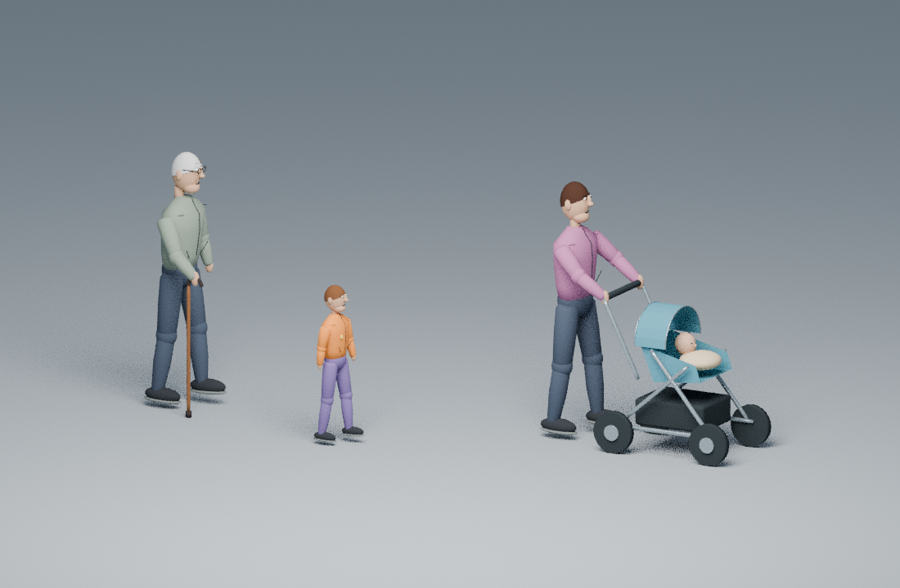

# Recorded urban road users

The README opening GIF shows an actual 46-second CPU RNE drive with two signals
and nineteen road users: five passenger vehicles, two trucks, seven pedestrians,
four bicycles and a dog walking beside a pedestrian. Ego waits, resumes after
green, yields to staggered crossings and stops behind the lead. The original
urban meshes include articulated people, detailed bicycles, a six-wheel delivery
truck, an animated dog with a leash, street-facing buildings, windows, entrances,
roof equipment, pavement and lamps. Assets are original Apache-2.0 geometry;
there are no external meshes, textures or asset downloads.

## Left-side driving and signal behavior

The authored forward route is at lateral 0 m; opposing vehicle centers are at
−8 m. The main street center is −4 m, so the +X ego route is on the **left**
side and opposing −X traffic is on its own left side. The checker measures
actual native ego and actor positions against that convention. Separate
asphalt strips visualize the actual opposing and service traffic motion.
These display strips are not additional operational routes or lane rules.

Infrastructure observations supply the mapped signals: the entry signal at
route s=12 m changes red to green at 8 seconds, and the second at s=34 m changes
at 24 seconds. Signal lamps display the recorded schedule. Independent checks
verify actual red-line clearance, stopped intervals, fresh infrastructure
observations and progress after green. Forward-lane traffic actors also use an
optional controller that consumes timestamped infrastructure observations:
red, unknown, missing or stale states impose a bounded braking envelope using
their declared full front extent and stop margin. A late, physically infeasible
stop is recorded as a violation; positions are never clamped to the line.
Actors starting downstream of a stop line do not reverse to stop at it.
Crossing walkers stop after reaching the opposite footpath rather than
continuing through scenery. Camera signal recognition, unscripted
intersection reasoning and traffic-law certification are not implemented.

Actor model assignments are rendering metadata only. Passenger vehicles use
IDs 0/3/7/8/9; trucks 10/11; pedestrians 1/4/6/14/15/16/17; bicycles
2/5/12/13; dog 18. Pedestrian 17 and dog 18 each have an actual recorded physical
proxy and share prescribed forward motion with 1.8 m separation. The leash
joins the displayed hand and collar; it does not apply force or steer either
actor. Walking, pedaling and canine gait are estimated cosmetic articulation.

## Vehicle size correction

The previous renderer multiplied every vehicle dimension by its collision
radius. Ego's radius was 2.285 m and the lead's was 1 m, making ego about 2.3×
larger. Current meshes use independent original SI presets:

| Model | Body length (m) | Body width (m) | Datum-to-roof height (m) |
| --- | ---: | ---: | ---: |
| Ego hatchback | 4.25 | 1.78 | 1.48 |
| Sedan | 4.65 | 1.82 | 1.46 |
| Van | 5.00 | 1.95 | 2.05 |
| Pickup | 5.35 | 1.95 | 1.82 |
| Delivery truck | 7.50 | 2.45 | 3.30 |

Body length/width exclude mirrors, wheels and the cosmetic sensor housing;
car bodies include handles and bumpers. Evaluated full bounds are recorded
separately. Tires remain round and wheel animation uses the actual SI radius.
The ego housing sits above each variant's roof, independently of the actual
LiDAR mount. The fixed 64 m orthographic urban camera gives all road users one
projection scale without zooming when distant actors enter or leave.

[Car mesh audit](../assets/vehicle-display-audit.json) checks four variants,
two physical radii, sensor presence and five wheel angles: **80 evaluated
poses**. [Truck, dog and city audit](../assets/city-display-audit.json) checks
**20 additional poses**, radius-independent dimensions, circular truck tires,
root pose retention and conservative scenery exclusion bounds.



This close-up is a separate showroom study. Its [historical render record](../assets/vru-models.json)
retains source/image hashes and five-pose geometry/root audits; it is not a
driving capture. The city recording uses the same original human/bicycle mesh
module, with per-actor clothing colors.



This separate showroom makes the smaller meshes visible. Actor 14 is an elder
with a cane, glasses and grey hair; actor 15 is a child with a fixed smaller
body; actor 16 is a parent pushing a four-wheel stroller with a visible baby.
The [family mesh audit](../assets/family-display-audit.json) measures **30 poses**,
including actual hand-to-cane and hand-to-pushbar contact, round 0.15 m stroller
tires, SI height, radius-independent geometry and unchanged recorded root poses.
The parent and stroller share one conservative 1.8 m physical proxy. The baby is
display geometry within that actor, not an independently sensed or moving actor.

## Physical verification and limits

[Independent city results](../assets/city-demo-results.json) retain three native
seeds, every sensor-only replay tick, actual XYZ/native ray and 200 Hz body checks,
continuous ego/actor and all 171 actor-pair distance bounds, dog/owner motion,
left-side placement and real signal stopping. The fixed 1 m clearance and final
stopping gates remain unchanged. Actor-pair bounds use zero prescribed speed
only after independently checking a `moving_until` stop; intervals that straddle
the stop retain the original speed bound. The ground checker is reused without changing
its existing physical tolerances. Displaying nineteen actors does not imply
that all nineteen are detected: the queued cars 8 and 9 are entirely occluded
from ego LiDAR. Some measured actor returns are removed by the ground fit;
per-ID measured and preserved counts are recorded rather than claiming perfect
ground classification or semantic recognition.

The optional [precise capsule query](../integrations/rne/CAPSULE_QUERY.md)
combines native non-capsule returns with exact f64 intersections of synchronized
physical ECS capsules. It corrects reproduced false positives and a missing
native dog-walker return, without expanding geometry or changing the pinned
engine or oracle tolerances. The snapshot is bounded to 1,024 rigid primitive
capsules. Native misses for other shapes remain unrecovered. Unflagged behavior
and historical output bytes remain unchanged. The complete mode contract is
recorded in capture and render provenance.

Physical moving actors remain upright capsule/circle proxies with prescribed
motion or bounded reactive following. Human intent, dog behavior, semantic
classification, avatar mesh ray casting, mesh collision/contact response and
production vehicle calibration are not implemented. A full-sized cosmetic
traffic mesh can extend beyond its proxy. Scene dressing and inferred extra
asphalt strips stay outside operational perception. Physical road support meshes
retain their actual recorded dimensions, with display-only corridor coloring.
Scenery placement excludes 1.2 m bands around recorded actor centerlines.
This is a display placement check; it does not prove clearance for every
full cosmetic mesh, or physically validate buildings or lamp posts. The fixed
urban camera faces the background facades; foreground display buildings are
hidden to keep ego and the stroller visible, with the count in render provenance.

## Reproduce

Install optional RNE tools with `bash scripts/setup-rne.sh`, activate
`source scripts/env.sh`, and build the locked binaries:

```sh
cargo build --release --locked --bin rustdriving
cargo +1.95.0 build --release --locked --manifest-path integrations/rne/Cargo.toml
python3 scripts/check-city-demo.py --compact --output artifacts/city-demo \
  --report artifacts/city-demo/report.json
```

With Blender and the pinned `scripts/requirements-demo.txt` in a virtual
environment, render the actual seed-7 capture:

```sh
python3 scripts/render_demo_3d.py artifacts/city-demo/seed-7/run.json \
  --native-scene artifacts/city-demo/seed-7/scene.json \
  --environment urban --camera street --dog-pairs 17=18 \
  --actor-models 0=sedan 1=pedestrian 2=cyclist 3=van 4=pedestrian \
    5=cyclist 6=pedestrian 7=sedan 8=hatchback 9=pickup 10=truck \
    11=truck 12=cyclist 13=cyclist 14=elder 15=child \
    16=parent_stroller 17=pedestrian 18=dog \
  --samples 12 --threads 3 --output artifacts/city-demo/demo.gif \
  --scene-output artifacts/city-demo/scene.blend
```

Use `--preview-time 26` for a PNG. The `.blend` is an editable last-state
snapshot. The GIF is 960 × 640 with 3× playback. [Render provenance](../assets/city-demo.json)
retains input/renderer/engine hashes, model assignments, unchanged display
scales, precise-query mode and recorded scene-state verification. Intentionally
refresh the README asset with `--output assets/city-demo.gif`.

Audit display geometry separately:

```sh
blender --background --factory-startup --threads 2 --python-exit-code 1 \
  --python scripts/check_vehicle_display.py -- \
  --output artifacts/vehicle-display-audit.json
blender --background --factory-startup --threads 2 --python-exit-code 1 \
  --python scripts/check_city_display.py -- \
  --output artifacts/city-display-audit.json
blender --background --factory-startup --threads 2 --python-exit-code 1 \
  --python scripts/check_family_display.py -- \
  --output artifacts/family-display-audit.json
```

The prior [three-actor GIF](../assets/vru-demo.gif) and its
[render provenance](../assets/vru-demo.json) preserve the original radius-scaled
cars and [physical evidence](../assets/vru-demo-results.json). The preceding
[ground/body GIF](../assets/ground-demo.gif) also remains a historical record.
Blender/Pillow/fonts can change visual bytes; sensor replay remains a separate
check on recorded observations.
