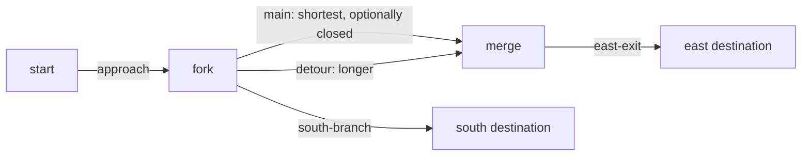

# Road networks and shortest-path navigation

RustDrive now selects a route from a directed road map before departure. The same map can send the vehicle to an eastern or southern destination; a known closure on the eastern shortcut selects a longer detour. The resolved route drives the existing sensor-only pipeline in both the reference simulator and CPU-only RNE. This is map-based navigation, with no intersection priority or traffic-light logic.

The opening README GIF is the actual seed-7 RNE dynamic detour run, rendered from telemetry at 3× speed. The inset shows supplied map topology, known closures, the selected route and the ego position for display. The orange shortcut is a map closure; it is not a fabricated LiDAR detection or a simulated barricade. Its [metadata](../assets/rne-demo.json) contains the exact scenario, selected edges and measured outcome.

## Implementation

`rustdrive-routing` is an independent library with only core contracts and serde as dependencies. Nodes have stable string IDs and world ENU positions in meters. Directed edges have IDs, from/to nodes, centerline points and positive half-widths. Edge cost is geometric arc length; reverse travel requires a separate directed edge.

Construction validates IDs, finite geometry, nonduplicate consecutive points, node references and endpoint agreement. Endpoint roundoff within 1 µm is canonicalized to the node position. Dijkstra uses the standard-library binary heap, sorted adjacency and deterministic tie-breaking. Closures apply to each request, without mutating the map. Unknown closures or destinations, a stationary start/goal request and unreachable destinations return errors. There is no fallback through a closed road.

The route plan records node IDs, edge IDs, distance and a concatenated `Route`, removing duplicate junction points. Its constant corridor width is the narrowest selected edge, a conservative restriction rather than variable-width lane modeling. The simulator passes this known navigation input and calibrated spawn pose to the existing pipeline. It never passes truth poses or object labels to routing, perception or local planning.



The three fixtures use the same five-node, five-edge map. `route-direct` selects `approach → main → east-exit`; `route-detour` closes `main` and selects `approach → detour → east-exit`; `route-south` selects `approach → south-branch`. Road geometry has gently curved branch connections. General maps with abrupt turns are not established as trackable by the current local planner/controller.

## Reproduce

```sh
cargo run --release --locked --bin rustdrive -- run \
  --scenario scenarios/route-detour.json --seed 7 --output artifacts/route-detour
cargo run --release --locked --bin rustdrive -- replay \
  --log artifacts/route-detour/sensors.jsonl --output artifacts/route-detour/replay

bash scripts/setup-rne.sh
# Activate a Pillow environment for GIF rendering.
bash scripts/rne-demo.sh dynamic assets/rne-demo.gif scenarios/route-detour.json

# All hazards and map routes, both backends, seeds 1/7/42, with full sensor replay.
bash scripts/check-hazards.sh
```

The optional scenario `navigation` contains `network`, `start`, `goal` and `closed_edges` (default empty). See the complete fixture JSON files for authored map geometry. When navigation is present, its selected centerline and minimum edge width replace the sine-road geometry; legacy `road_length` and `half_width` remain required compatibility inputs, and `curve_amplitude` stays optional but do not define this mapped road. Objects' `s` values are arc length on the selected route. The same obstacle specification therefore tests avoidance on each selected corridor; it does not represent a fixed world object shared between route choices. Closures are known external map information before driving, not inferred from these obstacles.

`run.json.navigation` retains the routing decision. The sensor log retains the resolved route in its pipeline configuration. Sensor replay recomputes localization through control with that route; it does **not** rerun Dijkstra or validate the map. Routing search tests and independent map/physical checks provide that separate evidence.

## Measured results

Local checks pass **85 workspace tests**, **9 RNE adapter tests**, formatting, Clippy with warnings denied, locked release builds and eleven reference scenario/replay pairs. The expanded suite passes **48 runs** across seeds 1/7/42, including **18 map-route runs**. Every run has zero colliding steps and road violations, complete sensor-output replay, valid profile kinematics, bounded normal commanded steering rates and its fixed clearance floor. These counts are finite fixture evidence, not a general navigation or safety guarantee.

The table reports seed-7 route length, elapsed simulation time and replay ticks; clearance is the worst value across all three seeds for that row. Full evidence: [routing-results.json](routing-results.json).

| Backend | Route | Length (m) | Time (s) | Replay ticks | Worst clearance (m) |
|---|---|---:|---:|---:|---:|
| Reference | Direct east | 200.00 | 28.85 | 578 | 0.783 |
| Reference | Closed-main detour | 209.53 | 30.30 | 607 | 0.597 |
| Reference | South destination | 163.62 | 24.35 | 488 | 0.836 |
| RNE dynamic | Direct east | 200.00 | 36.10 | 723 | 0.793 |
| RNE dynamic | Closed-main detour | 209.53 | 37.45 | 750 | 0.892 |
| RNE dynamic | South destination | 163.62 | 30.20 | 605 | 0.908 |

Six routing tests cover direction, closure/reopening, unreachable requests, malformed maps, deterministic equal-cost choices, endpoint canonicalization, and shortest distances against independently enumerated simple paths for every closure subset and distinct start/goal pair of an eight-edge cyclic graph. Three new reference integration tests cover seeded driving/replay, invalid or fully closed routes, and a collision-free run rejected by an increased clearance requirement. A new RNE test drives all three map fixtures. The suite independently verifies expected edge sequences, closure exclusion, connected endpoints, summed geometry length, selected route points and arrival within 2 m of the mapped destination.

## Clearance regression conditions

Optional scenario `min_clearance_m` is a nonnegative finite acceptance requirement. The evaluator compares it with the minimum circular separation, including synchronized swept relative segments between integration endpoints. It is never used as a perception or planning input. The negative integration test increases the requirement above a measured collision-free result and confirms acceptance fails without fabricating a collision.

The Python suite also enforces fixed fixture floors, chosen with reserve below the preceding measured results, and records each floor and measurement. They do not replace collision or road checks. The gates reject non-finite or sub-threshold values; local negative probes verified all nine fixture entries. The existing low-friction emergency limit of 20 ticks remains active.

| Fixture | Minimum clearance (m) |
|---|---:|
| Occluded crossing | 1.0 |
| Cut-in / opposing crossings | 0.7 |
| Multiple blocked alternatives | 3.0 |
| Low-friction avoidance | 0.4 |
| Low-friction stopping | 4.0 |
| Each mapped route | 0.5 |

These thresholds describe particular simulated circular footprints and scheduled actors. The 0.4 m low-friction floor preserves the previous tracking behavior with a small reserve; it is not a recommendation for real driving. Existing tracking tradeoffs and reduced clearance remain documented in [tracking.md](tracking.md).

## Boundaries and next work

Closures are applied before departure. Search can be called again with another closure set, but a moving vehicle's route handover, progress transfer and local-planner reset are not implemented. Maps are authored planar centerlines, without Lanelet2/OpenDRIVE import, lane-change topology, speed restrictions, turn penalties, road elevations, signals or right-of-way. The physical evaluator uses the selected conservative corridor; overlapping graph edges do not implement shared intersection traffic rules. Self-crossing-route progress ambiguity and arbitrary sharp-turn feasibility remain unresolved. The GIF is a top-down rendering of recorded CPU RNE data, not an engine camera or CARLA capture.
