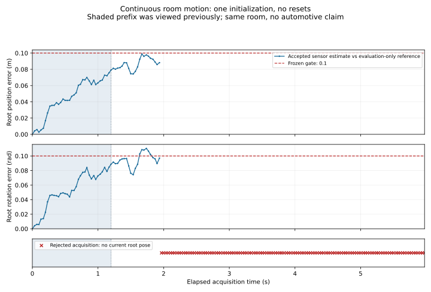

# Continuous recorded RGB-D temporal extension

The optional `rustdriving-rgbd-temporal` binary evaluates **180 consecutive
depth observations and 179 updates** from the same Freiburg 1 room recording.
Original indices **100–279** span **1305031914.108031–1305031920.081263 seconds**,
approximately **5.973232 seconds**. The purpose is to test accumulated motion
and rejection state across one continuous interval using unchanged estimator
defaults, rather than joining separately initialized short runs.

This is a **partly viewed temporal extension**. Its first 36 observations were
viewed in the earlier qualified trial; the following 144 image acquisitions
were previously unviewed. The complete numerical ground-truth source was already
parsed during that earlier scoring. It is not a new recording, independent
environment or generalization trial. All earlier sources, freezes and results
remain preserved, including the earlier **35/35 accepted and accurate updates**
over 1.168400 seconds. That short result does not establish success over this
longer interval.

## Continuous state and evidence roles

There is exactly one initialization, at source index 100, after measured
geometry validation. The measured root, last accepted reference, accepted-pose
clock and observed RGB clock continue through the entire 180-frame loop.
Index 136 changes an evidence label, not the operational state. There is no
restart at the prefix boundary, segment stitching or reference-pose reset.

The manifest makes viewing history explicit:

| Original depth indices | Role | Observations |
| --- | --- | ---: |
| 100 | `initialization` | 1 |
| 101–135 | `viewed_prefix` | 35 |
| 136–279 | `unviewed_extension` | 144 |

There are **173 unique RGB acquisitions and seven repeated associations**.
Depth indices **240, 243, 252, 267, 273, 275 and 278** repeat a previously
associated RGB acquisition. They remain selected and count toward the complete
179-update denominator. Repeated or failed observations supply no current root
pose and do not renew the accepted reference or clock. The observed image clock
advances even when fitting fails; the same image cannot retry a failed fit.
Tracking loss remains latched without evaluation-driven recovery.

## Qualification and immutable first extended run

The fixed source/window was preregistered before inspecting extension metadata
or acquiring missing images. Metadata qualification checks the entire pinned
depth and RGB indices and all reference-row arities and timestamp columns.
The source has **1,360 depth entries, 1,362 RGB entries and 4,887 reference rows**,
with finite, strictly increasing timestamps and no reference-time duplicates.
Pose columns are not numerically parsed during this preparation or preflight.
Every selected association is the nearest original RGB timestamp; exact ties
choose the earlier original index. No input is resized, retimed or omitted.

After the immutable metadata journal, **opaque byte acquisition** verified
lengths, SHA-256 and original Git-blob identities without inspecting image
signatures, headers, dimensions or pixels. The inventory has **357 files**:
180 depth images, 173 RGB images, three complete metadata tables and the pinned
camera document. It totals **103,275,775 bytes**; 76 earlier cached files were
verified and reused, and 281 missing images were acquired. This acquisition is
distinct from decoding or fitting.

The new path requires `--qualification`. The helper produces source-bound
metadata evidence; the Rust adapter and independent checker reconstruct it
from actual pinned tables before any image-reading stage. A proof with merely
self-consistent edited hashes is insufficient. Archive the exact algorithm,
configuration, qualification, acquisition and independent-checker sources and
freeze, then run the independent metadata-only preregistration audit **before
the first tail-image decode or fit**. The fixed window must fail on invalid
metadata; it is not replaced by a window selected using accuracy.

All operational sensor fits finish before reference transforms enter physical
scoring. The strict full-source numerical label reader still validates finite
poses, unit quaternions and increasing times, without normalization, deduplication
or trimming. Invalid labels retain sensor traces but make accuracy unscorable
and return exit 2. Evaluator exit 0 means physical protocol acceptance; exit 1
means a failed physical protocol. Independent integrity success is separate.

[The source record](../data/tum-fr1-room-temporal/SOURCE.md) documents exact
pins and the preregistration journal;
[the manifest](../data/tum-fr1-room-temporal/manifest.json) fixes all inputs.

## Unchanged algorithm and gates

The method retains measured FAST/BRIEF features, registered-depth checks,
robust 3D consensus and bounded Huber pixel refinement. Refinement uses at most
256 original consensus inliers and eight iterations. It composes refined
`previous_from_current` into the accepted root; rejection has no coarse-pose
fallback. No estimator, preprocessing, calibration or accuracy setting is tuned
against this extension.

| Gate | Bound |
| --- | --- |
| Absolute RGB/depth timestamp gap | 0.02 s |
| Reference interpolation bracket | 0.02 s; no extrapolation |
| Accepted-pose age | 0.20 s |
| Accepted root position error | 0.1 m |
| Accepted root rotation error | 0.1 rad |

Timestamp qualification uses unrounded seconds. Maximum observed association
gap is 0.017310142517089844 s and reference bracket is
0.011500120162963867 s; these are metadata measurements, not pose results.
The new adapter bounds its manifest to **512 KiB**, raw inventory to **128 MiB**
and serialized report to **64 MiB**. Individual raw files remain bounded to
4 MiB, and numerical reference parsing to 4 MiB and 30,000 rows. These are
capacity limits for the new temporal path, not performance or memory-use claims;
older paths retain their original limits.

The first continuous extension **fails the complete protocol, exit 1**.
All 179 updates and their references remain selected: **58 are accepted and 52
meet both root accuracy gates**, with 121 rejected updates and tracking loss.
There is exactly one initialization at index 100. The previous 36-frame prefix
is numerically identical to its original report after excluding only wall time
and the viewing-history tag.

| Interval | Updates | Accepted | Root-accurate | Rejected |
| --- | ---: | ---: | ---: | ---: |
| Previously viewed prefix, 101–135 | 35 | 35 | 35 | 0 |
| Extension, 136–279 | 144 | 23 | 17 | 121 |
| Entire continuous run, 101–279 | 179 | 58 | 52 | 121 |

Maximum accepted root errors are **0.098846 m / 0.110373 rad**. The first
accepted accuracy failure is index **149**, with 0.092472 m position error and
0.102856 rad rotation error: rotation exceeds the unchanged 0.1 rad gate.
Every accepted refinement reports convergence, demonstrating that optimizer
convergence alone cannot establish root accuracy.

Index **159** has 25 descriptor matches and 13 valid-depth pairs but no bounded
3D consensus. Indices **160–163** have only 4, 4, 7 and 10 valid-depth pairs,
below the unchanged minimum of 12; no pixel refinement runs on those failed
pairs. Index **164** exceeds the 0.20 s accepted-pose age by about 0.000560 s.
The last accepted pose is still index 158, and loss then remains latched through
279. The seven repeated RGB associations occur later, after loss; they remain
selected but do not explain the first tracking failure. The result is not
repaired by resetting the origin or deleting failures.



The plot leaves rejected poses missing and uses original acquisition time.
[First outcome](../assets/recorded-temporal/first-room-v1/phase1.json),
[full report](../assets/recorded-temporal/first-room-v1/results.json),
[independent archived-source audit](../assets/recorded-temporal/first-room-v1/audit.json)
and [viewed reproduction](../assets/temporal-regression.json) retain the evidence.
This is a partly viewed extension of the same indoor recording, with no new
environment or automotive generalization claim.

## Reproduction

Run from the repository root. Fetching is explicit opt-in; original bytes stay
ignored. Use new output paths because qualification and freeze evidence must
not overwrite an earlier run.

```sh
python3 -m pip install -r scripts/requirements-visual.txt
python3 scripts/fetch-temporal-dataset.py tum-fr1-room-temporal
python3 scripts/fetch-temporal-dataset.py tum-fr1-room-temporal --verify-only
source scripts/env.sh
cargo build --release --locked --manifest-path integrations/rgbd/Cargo.toml \
  --bin rustdriving-rgbd-temporal

temporal_manifest=data/tum-fr1-room-temporal/manifest.json
temporal_raw=data/tum-fr1-room-temporal/raw
temporal_binary=integrations/rgbd/target/release/rustdriving-rgbd-temporal
temporal_run=artifacts/recorded-temporal/local-protocol-v1
mkdir -p "$temporal_run"
python3 scripts/qualify-rgbd-temporal.py \
  --manifest "$temporal_manifest" --raw "$temporal_raw" \
  --output "$temporal_run/qualification.json"
```

Use the actual binary path when `CARGO_TARGET_DIR` is configured. The original
first-extension preparation records `preregistered_temporal_extension`, not a
fresh-sequence role, and performs a metadata-only audit:

```sh
"$temporal_binary" --manifest "$temporal_manifest" \
  --qualification "$temporal_run/qualification.json" \
  --prepare-freeze "$temporal_run/first-freeze.json"
python3 scripts/check-recorded-temporal.py \
  --manifest "$temporal_manifest" --raw "$temporal_raw" \
  --qualification "$temporal_run/qualification.json" \
  --freeze "$temporal_run/first-freeze.json" --preregister-only \
  --output "$temporal_run/preregistration.json"
```

Freeze preparation reads the manifest and qualification proof, without raw
images or numerical poses. Preserve the final source archive before the first
continuous run. Repeating preparation cannot restore previously unviewed status.
Later local evaluation requires `--regression` during both freeze preparation
and execution:

```sh
"$temporal_binary" --regression --manifest "$temporal_manifest" \
  --qualification "$temporal_run/qualification.json" \
  --prepare-freeze "$temporal_run/regression-freeze.json"
"$temporal_binary" --regression --manifest "$temporal_manifest" \
  --qualification "$temporal_run/qualification.json" --raw "$temporal_raw" \
  --freeze "$temporal_run/regression-freeze.json" \
  --output "$temporal_run/results.json"
```

Once the immutable first-extension archive is present, the suite audits it and
reproduces the viewed run with an independent checker:

```sh
python3 scripts/check-recorded-temporal-suite.py \
  --binary "$temporal_binary" \
  --output artifacts/recorded-temporal/local-suite-v1
```

The suite retains evaluator physical exit status, compares non-timing evidence,
checks all 179 updates, and verifies the first 36 frames against the earlier
qualified prefix while allowing their explicit viewing-role labels to differ.
It reconstructs features, matches, refinement, root composition and rejection
state independently. A passing reproduction audit does not change the physical
protocol outcome or make viewed data independent evidence.

## Calibration, licensing and scope

The source commit remains
`edrishakimi1/Indoor-SLAM-Floorplan-with-Gaussian-Splatting@1d5b2c3e1ee186abc1709042b739e9cd8a3b41d1`.
The unchanged published TUM1 profile is pinned from
`luigifreda/pyslam@96019cfafcfc099ac9866884d7143a9ed1451a0d`,
`settings/TUM1.yaml`: 640×480, fx=517.306408, fy=516.469215, cx=318.643040,
cy=255.313989 and 5000 depth units per metre. The optical frame is
x-right/y-down/z-forward. Published distortion remains provenance metadata;
pinhole projection without added undistortion, range correction or RGB/depth
time compensation is a research approximation. Infrared extrinsics, source
registration and in-situ metric or vehicle calibration are not independently
measured. There is no recalibration against this interval.

Raw RGB, depth, reference labels and camera YAML are not redistributed or
relicensed. Mirror pins establish transfer provenance, not a redistribution
grant. Original TUM license terms remain unverified: the official dataset page
returned HTTP 403 through the configured proxy during earlier acquisition.
Explicit opt-in downloads retain HTTPS proxy and TLS verification; no upstream
algorithm code is copied.

This approximately six-second indoor sequence tests temporal continuity with
viewed overlap. It establishes no independent environmental coverage,
long-duration mapping, global relocalization, automotive generalization,
calibrated covariance, driving integration, real-time performance or
real-vehicle safety. See [the earlier qualified trial](qualified-recorded-motion.md)
and [the underlying refinement contract](recorded-reprojection.md) for the
preserved evidence and algorithm limits.

## Reproduce the error figure

The figure is an optional static export, separate from the evaluator and CI
oracle. Matplotlib 3.10.8 is pinned for this export. Rejected poses are plotted
as missing values, without connecting error curves across rejected acquisitions.

```sh
python3 -m pip install -r scripts/requirements-temporal-plot.txt
MPLCONFIGDIR=artifacts/temporal-plot-cache XDG_CACHE_HOME=artifacts/temporal-font-cache \
  python3 scripts/plot-temporal-motion.py \
  --report assets/recorded-temporal/first-room-v1/results.json \
  --output artifacts/temporal-root-errors.svg \
  --metadata artifacts/temporal-root-errors.json
```

The [export metadata](../assets/temporal-root-errors.json) binds the source report,
plot script, export version and SVG hash. It is descriptive evidence, not an
additional accuracy or performance benchmark.
