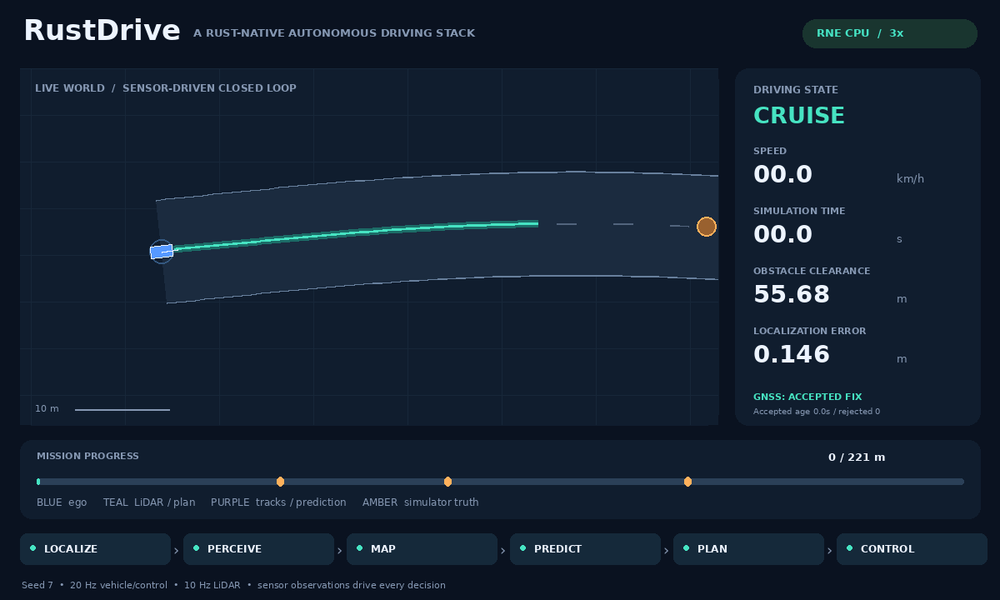

# Terminal stopping and post-arrival physical evaluation

RustDriving now reaches the destination in the original GNSS-burst traffic world and remains clear while the scheduled lead catches up. The repair uses candidate arc length for goal stopping and a feasible lateral stopping-place preference near the endpoint. Sensors, estimation, planning and control continue during a new optional physical residence period. No simulator actor labels, fault schedule or truth pose enter planning.



This is recorded RNE dynamic seed 7 on `gnss-burst-traffic-hold`, rendered top-down at 3× playback speed. The vehicle rejects the three-second GNSS bias, brakes, resumes, avoids the original three scheduled actors and stops to the side of the centerline. The recording continues for 16 seconds after arrival and includes the lead reaching the endpoint. The engine revision remains `df6007aa40315e81d12ae00fc1f60369e393a178`; no GPU, native renderer or CARLA server is involved.

## Two defects and the repair

At GNSS baseline `e35c483fa6b9d6e33240fc4871b19648d65a768d`, the original RNE seed-7 world had 32 colliding integration ticks, minimum clearance −1.049 m, no goal completion and 1301 correctly replayed ticks. The EKF recovered with at most 0.301 m position error, so the remaining failure was planning/terminal behavior. The unchanged baseline evidence is retained in [gnss-results.json](gnss-results.json), and the original world, timing, duration, speed, plant calibration and 0.5 m clearance criterion remain in `gnss-burst-traffic.json`.

The goal profile incorrectly used route-direction progress as its stop distance along a candidate that also moved sideways. Such a candidate has a different arc length; truncation could stop it before its generated endpoint. Goal stops now use the sum of actual geometric segment lengths. A unit regression independently requires the exact one-meter-before-endpoint position after a lateral return, zero terminal speed and the unchanged eight-second planned hold.

Distance correction alone made the original seed-7 episode reach its goal at 42.60 s with zero collisions. That was insufficient: ending evaluation on first arrival concealed a later rear collision. An intermediate experiment, with the same world and an **eight-second** post-arrival residence, produced 28 collision ticks and −0.777 m clearance despite `reached_goal=true`; physical acceptance correctly failed. This experiment is distinguished from the final, stricter sixteen-second fixture in [terminal-results.json](terminal-results.json).

Constant-velocity predictions cover only eight seconds and then retain their last endpoint. They can therefore end before a slower vehicle behind ego reaches the goal. Once ego is within 41 m of the route endpoint, the planner checks observed forecasts: the current object position spans the centerline within its fitted radius plus 0.3 m, it is no farther than 40 route meters behind ego, and its first predicted interval advances along the route faster than 0.7 m/s. These conditions add a cost of 5 to center-target candidates. Selecting a feasible side latches that preference through forecast jitter, missed tracks and the actor becoming stationary; the existing lateral maneuver anchor retains progress. The preference never overrides road containment, reachable speed bounds, synchronized circular collision sweeps or stop/hold revalidation. A new planner after a route handover starts with no terminal reservation.

This is a heuristic stopping-place preference, not a forecast that claims to model interaction or lane semantics. The optional scenario residence duration is absent from pipeline configuration. The planner's stationary sweep remains eight seconds, with unchanged collision envelopes and acceleration/deceleration authority.

## Physical residence and independent checks

Optional `goal_hold_seconds` changes **acceptance**, not the command source. A goal episode continues all sensing, algorithm steps, plant motion and physical scoring until the vehicle continuously satisfies the existing truth goal-progress/destination and speed-below-0.2-m/s criteria for that duration. Leaving the goal or exceeding the speed threshold resets the clock. Insufficient episode time fails. First-arrival and final truth frames are retained even between the usual 10 Hz frames.

`gnss-burst-traffic-hold` adds only a name and `goal_hold_seconds=16` to the original traffic world. Sixteen seconds lets both the faster reference plant and RNE observe the original moving lead reaching its clamped endpoint. The 65 s episode limit, actors/schedules, road, GNSS bias, noise, cruise defaults and 0.5 m physical clearance floor are unchanged.

The standard-library Python checker independently projects evaluator truth onto the original route polyline and checks the full recorded residence interval: speed below 0.2 m/s, progress within the existing 2 m endpoint band, displacement at most 0.5 m, at least 0.5 m sampled circular clearance and lead position at the original endpoint. The simulator additionally checks swept clearance throughout every 20 Hz integration interval. GNSS rejection/freshness/recovery checks and full sensor-log recomputation apply to both new fixtures. A separate negative reference simulation proves that an actor appearing after first arrival causes physical failure when residence is enabled, even though the same world with early termination passed.

## Terminal-stopping baseline results (2026-10-09, Asia/Tokyo)

The measurements below record `4b6d2049f39037d7ae2fb958b907bf979511ea97`; [reactive traffic](reactive-traffic.md) supersedes the suite counts while retaining these original cases. At that baseline, formatting, Clippy with warnings denied, locked builds, **115 workspace tests** and **13 RNE tests** pass. The reference script passes twenty scenario/replay pairs. The seeded suite passes **102 positive runs**: 48 reference and 54 RNE dynamic, including 30 GNSS-fault runs and 24 live-navigation runs. All have full replay, zero collision/road/closed-edge violations and unchanged clearance, profile and normal-steering gates. Twelve added runs cover the original traffic fixture and the extended physical-hold fixture in both plants across seeds 1/7/42. [Complete compact results and source fingerprint](terminal-results.json).

Time and replay counts use seed 7; clearance/error are the worst across all three seeds. Hold-case time includes the full residence.

| Backend | Fixture | Time (s) | Replay ticks | Worst clearance (m) | Max position error (m) |
|---|---|---:|---:|---:|---:|
| reference | `gnss-burst-traffic` | 37.60 | 753 | 0.532 | 0.182 |
| reference | `gnss-burst-traffic-hold` | 53.60 | 1073 | 0.532 | 0.182 |
| rne-dynamic | `gnss-burst-traffic` | 43.20 | 865 | 0.917 | 0.415 |
| rne-dynamic | `gnss-burst-traffic-hold` | 59.20 | 1185 | 0.917 | 0.415 |

Every hold run observes the original lead at the endpoint, preserves the required sixteen seconds of sampled goal residence, and satisfies the additional 0.5 m maximum-displacement gate. The initial GNSS-burst stop/recovery diagnostics remain bounded. The detailed per-seed residence clearance and movement are in the results JSON.


## Reproduce

```sh
bash scripts/check.sh
bash scripts/setup-rne.sh
bash scripts/check-hazards.sh --output artifacts/goal-verified
# With the documented Pillow environment activated:
python3 scripts/render_demo.py \
  artifacts/goal-verified/rne-dynamic/gnss-burst-traffic-hold/seed-7/run.json \
  --output assets/terminal-demo.gif
# A single native episode:
cargo +1.95.0 run --release --locked --manifest-path integrations/rne/Cargo.toml -- \
  --scenario scenarios/gnss-burst-traffic-hold.json --plant dynamic --seed 7 \
  --output artifacts/terminal-hold
cargo run --release --locked --bin rustdriving -- replay \
  --log artifacts/terminal-hold/sensors.jsonl --output artifacts/terminal-hold/replay
```

## Limits and next work

The demonstrated refuge is a circular ego footprint at one of three lateral offsets in a supplied wide planar corridor. Narrow roads, both sides occupied, constrained mapped destinations, late/unobservable traffic and an already trapped stationary vehicle can still have no feasible escape. The persistent side preference does not provide a general parking policy or terminal cost optimizer. Rectangular bodies, interaction-aware forecasts, braking/yielding actors, traffic rules and general recovery remain unimplemented. The residence test bounds a finite authored episode; it does not prove indefinite clearance or real-vehicle safety. Logs must be regenerated after changed planning arithmetic, while the sensor-log encoding remains unchanged. No real-time performance claim is made.
