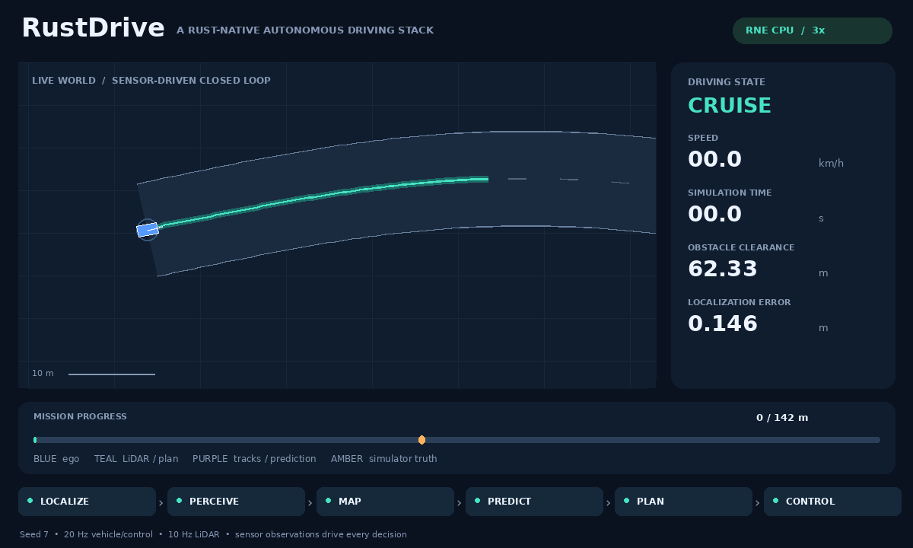

# Smoother tracking on CPU-only RNE

The shared planner now interpolates route geometry smoothly, joins paths to the estimated heading, and reserves nominal braking headroom. The controller interpolates its pursuit target. In the unchanged low-friction RNE fixture, emergency ticks fall from **73/83/80 to 9/8/7** for seeds 1/7/42. All 30 physical acceptance/replay cases still pass. This is an improvement in these fixtures, not a general dynamic-feasibility or safety guarantee.



The GIF is rendered from a real RNE dynamic run with supplied friction coefficient 0.2 and steering lag 0.15 s. These are configured plant parameters, not online estimates. Its [provenance](../assets/tracking-demo.json) records the engine pin, scenario, seed, metrics and regeneration command.

## Reproduced causes and changes

Inspection of the previous sensor recordings found emergency trajectories with healthy sensing. Recomputing the previous committed planner reproduced two failure patterns. During avoidance, a route-knot/normal jump made the reachable speed envelope fall below the measured speed: at t=10.10 s in seed 7, the measured speed was 5.98183 m/s and the retained avoidance candidate allowed 5.85786 m/s. Near the goal, a saturated braking envelope had little room for observation noise: at t=23.90 s, 6.01308 m/s exceeded the center candidate's 5.98724 m/s bound. The planner correctly rejected those supplied paths; the repair changes path construction and nominal speed planning rather than bypassing rejection.

**Geometry.** Private quintic Hermite interpolation shares centerline position, first derivative and second derivative at route knots. Continuous normal offsets remove the previous polyline-normal position jumps. A fading position/tangent correction joins a persistent lateral maneuver to the current estimated pose, using a finite-difference tangent and measured heading. The supplied route, simulator road and actor schedules stay unchanged. Generated candidate samples are checked against the original corridor with the circular footprint; ambiguous containment uses the full route projection. The interpolation is not a global router or a continuous-road-boundary proof.

**Braking.** Desired profiles use 80% of calibrated deceleration. Hard speed envelopes continue to use the full calibrated authority. A state above the comfortable envelope can recover with full bounded braking; an unreachable hard curvature/stop bound still rejects the candidate. Forward acceleration limits, constant-acceleration arrival times, synchronized circular sweeps and retimed-stop validation remain active.

**Goal recovery.** One meter before the route endpoint remains the desired stop. If the estimate passes that point while moving, the planner generates a monotonically braking profile within the remaining corridor. It does not reaccelerate toward a continually moving stop target. The route endpoint remains a hard limit, and an impossible stop still yields emergency braking. Physical goal/collision/road acceptance is unchanged.

**Steering.** Pure pursuit selects the intersection with its lookahead circle, interpolating between path samples instead of jumping to the next sample index. The preview is `clamp(3 + 0.45 * speed, 3, 8)` meters. At 6 m/s, it is 5.7 m; the previous preview was 7.4 m. The 0.7 rad/s commanded steering-rate limit remains. After a controller emergency, its steering reference resets to the zero command it emitted, avoiding a stale-reference jump on recovery. This does not estimate or guarantee the actual tire/actuator state.

## Tests and acceptance gates

- Exact straight-route interpolation with unequal segment lengths, and continuous offset position/heading at a route knot.
- Joining the measured heading, preserving maneuver progress after the correction fades, rejecting invalid heading and retaining sampled corridor bounds.
- Nominal braking headroom, feasible recovery with full hard authority, and rejection of a genuinely impossible stop.
- Monotonic goal recovery inside the remaining corridor and emergency rejection when the endpoint cannot be reached safely under the supplied braking model.
- A known circular path's interpolated pursuit target and steering, plus bounded steering recovery after an emergency command.
- The existing oncoming/interior-contact, acceleration-timed crossing and retimed-stop regressions remain passing.

Formatting, Clippy with warnings denied, locked release builds, **76 workspace tests**, **8 RNE adapter tests**, and eight reference scenario/replay pairs pass locally. The hazard suite runs the same 30 cases with seeds 1/7/42. Each case retains physical collision/road evaluation, full sensor-output recomputation and independent profile-kinematics checks. New command metrics measure emergency fraction, RMS commanded acceleration change per second and maximum steering rate between normal commands. The latter must remain at most 0.7 rad/s. Both the multi-seed RNE test and hazard CLI additionally require at most **20 emergency ticks** in the specified low-friction avoidance fixture. This stricter regression gate does not relax physical criteria.

## Measured comparison

The baseline is published commit `7a6ada6b5301276bed046274f771d7e64253c4a0`, with the same RNE pin and plant calibration. Baseline command metrics were computed from its retained sensor logs; its original [acceptance snapshot](speed-planning-results.json) remains unchanged. The [new result snapshot](tracking-results.json) includes both summaries and command metrics, baseline/current source fingerprints, replay counts and engine revision. Full current evidence is in ignored `artifacts/tracking/`.

| Seed | Emergency ticks before → after | Emergency fraction before → after | RMS commanded acceleration change before → after (m/s³) | Minimum clearance before → after (m) |
|---|---|---|---|---|
| 1 | 73 → 9 | 12.67% → 1.54% | 48.93 → 22.90 | 1.277 → 0.443 |
| 7 | 83 → 8 | 14.24% → 1.36% | 51.15 → 19.38 | 1.372 → 0.435 |
| 42 | 80 → 7 | 13.86% → 1.19% | 48.39 → 21.24 | 1.238 → 0.578 |

Commanded acceleration change is measured at the 20 Hz command timestamps, including emergency transitions. It is a command metric, not passenger comfort or physical jerk: the RNE adapter applies friction and actuation bounds separately. Measured clearance is smaller in this fixture after the changes; every run still has zero evaluated collisions and road violations under the unchanged criteria. No universal clearance improvement is claimed.

| Backend | Scenario | Passing seeds | Worst clearance (m) | Seed 7 time (s) | Seed 7 emergency ticks before → after | Seed 7 replay ticks |
|---|---|---|---|---|---|---|
| reference | cut-in | 3/3 | 0.819 | 20.85 | 56 → 27 | 418 |
| reference | multiple-blocked | 3/3 | 3.623 | 25.00 | 11 → 1 | 501 |
| reference | occluded-crossing | 3/3 | 1.715 | 21.40 | 34 → 2 | 429 |
| reference | opposing-crossings | 3/3 | 0.873 | 23.35 | 57 → 26 | 468 |
| rne-dynamic | cut-in | 3/3 | 0.809 | 23.25 | 28 → 1 | 466 |
| rne-dynamic | low-friction | 3/3 | 0.435 | 29.30 | 83 → 8 | 587 |
| rne-dynamic | low-friction-stop | 3/3 | 4.572 | 40.00 | 23 → 8 | 801 |
| rne-dynamic | multiple-blocked | 3/3 | 3.779 | 25.00 | 9 → 7 | 501 |
| rne-dynamic | occluded-crossing | 3/3 | 1.339 | 26.20 | 25 → 1 | 525 |
| rne-dynamic | opposing-crossings | 3/3 | 0.809 | 26.65 | 27 → 4 | 534 |

## Reproduction and limits

```sh
bash scripts/check.sh
bash scripts/check-hazards.sh --output artifacts/tracking
python3 -m pip install -r scripts/requirements-demo.txt # Use a venv for rendering.
python3 scripts/render_demo.py artifacts/tracking/rne-dynamic/low-friction/seed-7/run.json --output artifacts/tracking/low-friction.gif
```

The README opening RNE mission GIF was regenerated: 799 sensor ticks, 134 GIF frames, full replay, zero collisions/road violations and 11 emergency ticks. Reference and occluded-crossing media were regenerated too. The engine pin remains `df6007aa40315e81d12ae00fc1f60369e393a178`; no RNE source or native plant parameters changed.

Emergency fallback remains in several fixtures. Heading matching, sampled curvature and braking headroom do not establish steering-rate feasibility of the planned trajectory, a combined friction ellipse, jerk optimization, guaranteed closed-loop tracking, interactive prediction or traffic semantics. Supplied planar roads, circular targets, fixed calibration, heuristic uncertainty and an eight-second constant-velocity forecast remain the demonstrated domain. No throughput, real-time or real-vehicle guarantee is established. Algorithm outputs changed; regenerate recordings for exact replay with this binary, although sensor record schema 1 remains readable.
