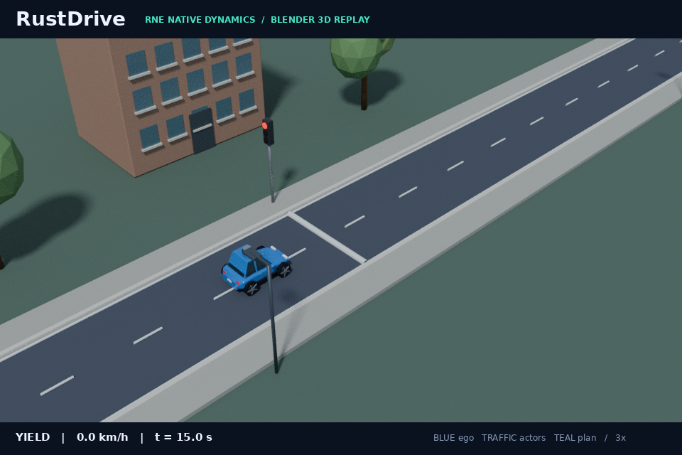

# Mapped traffic signals and stop-line behavior

RustDrive now stops before mapped lines for red, yellow or unknown signals and resumes on a fresh green observation. This is an executable traffic-control baseline on authored, fixed, straight routes. It uses a **synthetic infrastructure state feed**, not camera recognition, simulator object labels or privileged future signal timing.



The image is a Blender Cycles CPU replay of the actual native run. The roadside lamp shows the simulator's infrastructure phase; the driving stack separately consumes timestamped observations. The meshes and road markings do not enter LiDAR or collisions. The existing opening, follower and fleet GIFs retain their preceding captures.

## Run and reproduce

The reference simulator needs only Rust:

```sh
cargo run --release --locked --bin rustdrive -- run \
  --scenario scenarios/signal-red-green.json --seed 7 --output artifacts/signals
cargo run --release --locked --bin rustdrive -- replay \
  --log artifacts/signals/sensors.jsonl --output artifacts/signals/replay
```

After `bash scripts/setup-rne.sh`, use native dynamics:

```sh
cargo +1.95.0 run --release --locked --manifest-path integrations/rne/Cargo.toml -- \
  --scenario scenarios/signal-red-green.json --plant dynamic --seed 7 \
  --output artifacts/signals-native/signal-red-green
cargo run --release --locked --bin rustdrive -- replay \
  --log artifacts/signals-native/signal-red-green/sensors.jsonl \
  --output artifacts/signals-native/signal-red-green/replay
# Optional Blender/Pillow visualization and editable snapshot:
python3 scripts/render_demo_3d.py artifacts/signals-native/signal-red-green/run.json \
  --preview-time 15 --output assets/traffic-signal-preview.gif \
  --scene-output artifacts/3d/traffic-signal-scene.blend
```

A preview produces a PNG; omit `--preview-time` and use an artifact GIF path to render the full episode. Do not overwrite the historical README GIFs accidentally. CI renders the native signal preview and exports its editable `.blend` snapshot.

## Operational contracts

The map supplies `PipelineConfig.stop_lines`: unique string IDs and finite arc lengths in meters on the fixed route. The initial implementation rejects combining them with live route handover. The sensor input optionally contains a complete `traffic_signal` snapshot with one acquisition stamp and exactly one color per configured ID. Colors are `Red`, `Yellow`, `Green`, `Unknown`.

A valid observation can release a line only while its accepted age is at most **0.5 s**. Missing, stale or explicitly unknown signals impose a stop. Duplicate/reordered acquisition stamps cannot refresh the accepted clock or replace a later red with an older green. Future stamps, missing IDs, duplicate IDs and unknown IDs latch an invalid-signal fault and emit the existing emergency command until a new valid complete snapshot arrives. There is no driver-side phase schedule, dropout label or next-green time.

The nearest unpassed, nonpermissive line creates a temporary route prefix ending one meter before the mapped line minus ego radius. The existing planner additionally targets a stop one meter before that endpoint, with reachable acceleration/braking profiles and collision/hold revalidation. The full active route and localization/tracking state remain intact. A fresh green removes the prefix and permits progress. A line is committed only with healthy localization/sensing and fresh green when the estimated circular front reaches it; a later red behind an already committed vehicle does not command reversal.

Configured stop lines are map information, not camera detections. Signal phases and feed dropout windows belong only to the simulator. The common loop synthesizes snapshots at 5 Hz for both ego plants and records all 20 Hz physical/control ticks. Optional fields preserve replay of preceding logs that do not configure traffic controls.

## Measured acceptance

The six fixtures are `signal-red-green`, `signal-red-stop`, `signal-stale-stop`, `signal-stale-recovery`, `signal-two-stops` and `signal-approach-change`. Both plants pass all six across seeds 1, 7 and 42: **36 physical episodes with complete sensor-only replay**. Across the 36, the smallest margin from the circular physical front to a nonpermissive observed stop line is **1.926626 m**. Every tested stop maintains at least **2.65 s** of continuous close-line standstill against a fixed **2 s** gate; the independent physical-margin floor is **1 m**.

| Native seed-7 fixture | Outcome | Continuous close-line hold | Crossing / completion |
|---|---|---|---|
| Red → green | Stops and resumes | 9.40 s | Green at 20 s; front crosses at 21.40 s; goal at 38.60 s |
| Permanent red | Remains stopped | 19.45 s | No crossing in 30 s |
| Permanent observation loss | Stops despite last known green | 17.55 s | No crossing in 30 s |
| Observation recovery | Stops on expired green, resumes on fresh green | 5.55 s | Feed recovers at 18 s; front crosses at 19.40 s; goal at 34.20 s |
| Two signals | Stops at red, then at yellow, resumes twice | 9.40 / 8.20 s | Front crosses at 21.40 / 43.40 s; goal at 57.00 s |
| Changing signal on approach | Drives on green, stops after yellow/red, resumes | 10.05 s | Yellow at 4 s, red at 6 s, green at 20 s; front crosses at 21.40 s; goal at 38.65 s |

Rule evaluation uses actual physical front crossings against the external phase schedule, independently of planner mode and reported control status. The Python acceptance checker additionally reconstructs acquired snapshots/dropouts, accepted freshness, true and observed permission at each crossing, close-line continuous holds and physical margins. A negative backend test deliberately ignores braking commands and drives through red; independent acceptance rejects its actual crossing.

The complete suite passes **168 positive episodes** (81 reference, 87 native), preserving the preceding 132 fixtures/seeds and their profile/steering/collision/clearance gates. The two known five-meter follower sensing failures remain separately rejected and excluded from that count. [Signal measurements, checker/source hashes and preview provenance](../assets/signal-results.json).

## Boundaries and remaining work

This is the first rule-aware behavior primitive, not general intersection driving. Yellow always requests stopping; there is no dilemma-zone decision. Other vehicles do not yet obey these lights or negotiate priority. Mapped stop signs and basic fixed-route priority yielding are implemented separately ([stop-sign behavior](stop-signs.md), [mapped crossings](intersections.md)). General right-of-way negotiation, all-way stop ordering, lane topology, pedestrian semantics, signal confidence, camera recognition, V2X networking and live-handover signal remapping remain unimplemented. A misclassified fresh green is not corrected by an independent recognition channel. Infeasible/late stops use existing emergency behavior; that cannot guarantee avoidance of a late physical crossing.

The current circular-front model and 1 m fixture gate are simulation acceptance choices, not real vehicle geometry or a road-safety specification. Native runs still show a few conservative emergency ticks near short stopping profiles/goals, and the reference controller can settle more slowly. No comfort, real-time throughput or real-vehicle claim is made. [50% planning goal and evidence requirements](maturity.md).
